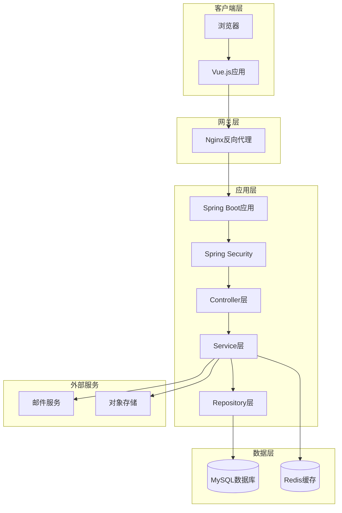
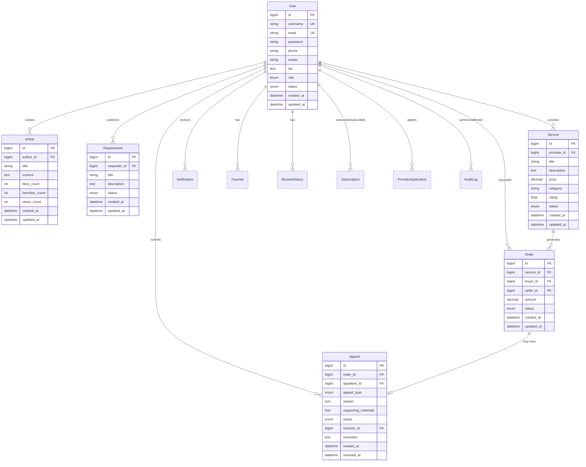
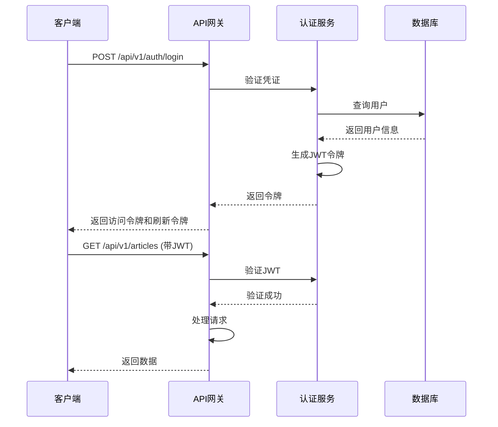
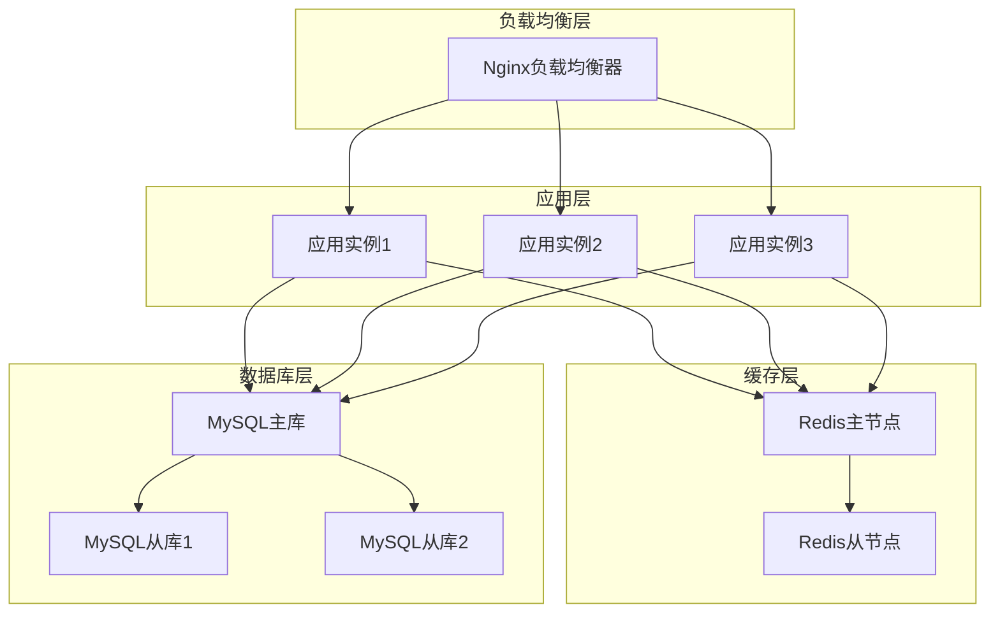

# 设计文档

## 概述

本文档描述了基于Spring Boot和Vue.js构建的服务平台系统的技术设计。该平台是一个全功能的服务交易平台，支持三种用户角色（普通用户、服务提供者、管理员），提供文章发布、需求发布、服务交易、订单管理、申诉处理等核心功能。

### 系统目标

- 提供稳定、安全、高性能的服务交易平台
- 实现清晰的角色权限管理和访问控制
- 支持完整的交易生命周期管理
- 提供类似CSDN的用户体验
- 确保数据一致性和系统可审计性

### 技术栈

**后端技术栈：**
- Spring Boot 3.x - 核心框架
- Spring Security - 认证和授权
- Spring Data JPA - 数据访问层
- MySQL 8.0 - 关系型数据库
- Redis - 缓存和会话存储
- JWT - 无状态认证
- Maven - 项目构建工具

**前端技术栈：**
- Vue.js 3.x - 前端框架
- Vue Router - 路由管理
- Pinia - 状态管理
- Element Plus - UI组件库（类CSDN风格）
- Axios - HTTP客户端
- Vite - 构建工具

**部署和运维：**
- Docker - 容器化
- Nginx - 反向代理和静态资源服务
- Jenkins/GitHub Actions - CI/CD
- ELK Stack - 日志管理
- Prometheus + Grafana - 监控

## 架构设计

### 整体架构

系统采用前后端分离的架构模式，前端Vue.js应用通过RESTful API与后端Spring Boot服务通信。




### 分层架构

系统采用经典的三层架构模式：

**1. 表现层（Presentation Layer）**
- Vue.js组件负责UI渲染和用户交互
- 通过Axios发送HTTP请求到后端API
- 使用Pinia管理应用状态
- 实现响应式设计，支持桌面和移动端

**2. 业务逻辑层（Business Logic Layer）**
- Spring Boot Controller接收HTTP请求
- Service层实现核心业务逻辑
- 事务管理确保数据一致性
- 业务规则验证和权限检查

**3. 数据访问层（Data Access Layer）**
- Spring Data JPA提供ORM映射
- Repository接口定义数据访问方法
- 数据库事务管理
- 缓存策略优化查询性能


### 微服务 vs 单体架构选择

**选择：单体架构（Monolithic Architecture）**

**理由：**
1. 系统规模适中，功能模块耦合度较高
2. 简化部署和运维复杂度
3. 降低分布式系统的网络开销
4. 便于开发和调试
5. 满足当前性能需求（支持1000并发用户）

**未来扩展路径：**
- 当系统规模增长时，可以按业务域拆分为微服务
- 优先拆分的候选模块：订单服务、通知服务、搜索服务

## 数据库设计

### 数据库选型

**选择：MySQL 8.0**

**理由：**
1. 成熟稳定，社区支持完善
2. 支持ACID事务，确保数据一致性
3. 丰富的索引类型，优化查询性能
4. 支持JSON字段，灵活存储非结构化数据
5. 主从复制支持高可用

### 实体关系图（ER Diagram）




### 核心表结构设计

#### 1. 用户表（users）

```sql
CREATE TABLE users (
    id BIGINT PRIMARY KEY AUTO_INCREMENT,
    username VARCHAR(50) NOT NULL UNIQUE,
    email VARCHAR(100) NOT NULL UNIQUE,
    password VARCHAR(255) NOT NULL,
    phone VARCHAR(20),
    avatar VARCHAR(500),
    bio TEXT,
    role ENUM('USER', 'PROVIDER', 'ADMIN') NOT NULL DEFAULT 'USER',
    status ENUM('ACTIVE', 'SUSPENDED', 'DELETED') NOT NULL DEFAULT 'ACTIVE',
    created_at DATETIME NOT NULL DEFAULT CURRENT_TIMESTAMP,
    updated_at DATETIME NOT NULL DEFAULT CURRENT_TIMESTAMP ON UPDATE CURRENT_TIMESTAMP,
    INDEX idx_username (username),
    INDEX idx_email (email),
    INDEX idx_role (role),
    INDEX idx_status (status)
) ENGINE=InnoDB DEFAULT CHARSET=utf8mb4 COLLATE=utf8mb4_unicode_ci;
```

#### 2. 文章表（articles）

```sql
CREATE TABLE articles (
    id BIGINT PRIMARY KEY AUTO_INCREMENT,
    author_id BIGINT NOT NULL,
    title VARCHAR(200) NOT NULL,
    content TEXT NOT NULL,
    likes_count INT NOT NULL DEFAULT 0,
    favorites_count INT NOT NULL DEFAULT 0,
    views_count INT NOT NULL DEFAULT 0,
    created_at DATETIME NOT NULL DEFAULT CURRENT_TIMESTAMP,
    updated_at DATETIME NOT NULL DEFAULT CURRENT_TIMESTAMP ON UPDATE CURRENT_TIMESTAMP,
    FOREIGN KEY (author_id) REFERENCES users(id) ON DELETE CASCADE,
    INDEX idx_author_id (author_id),
    INDEX idx_created_at (created_at),
    FULLTEXT INDEX ft_title_content (title, content)
) ENGINE=InnoDB DEFAULT CHARSET=utf8mb4 COLLATE=utf8mb4_unicode_ci;
```

#### 3. 需求表（requirements）

```sql
CREATE TABLE requirements (
    id BIGINT PRIMARY KEY AUTO_INCREMENT,
    requester_id BIGINT NOT NULL,
    title VARCHAR(200) NOT NULL,
    description TEXT NOT NULL,
    status ENUM('OPEN', 'IN_PROGRESS', 'CLOSED') NOT NULL DEFAULT 'OPEN',
    created_at DATETIME NOT NULL DEFAULT CURRENT_TIMESTAMP,
    updated_at DATETIME NOT NULL DEFAULT CURRENT_TIMESTAMP ON UPDATE CURRENT_TIMESTAMP,
    FOREIGN KEY (requester_id) REFERENCES users(id) ON DELETE CASCADE,
    INDEX idx_requester_id (requester_id),
    INDEX idx_status (status),
    INDEX idx_created_at (created_at),
    FULLTEXT INDEX ft_title_description (title, description)
) ENGINE=InnoDB DEFAULT CHARSET=utf8mb4 COLLATE=utf8mb4_unicode_ci;
```

#### 4. 服务表（services）

```sql
CREATE TABLE services (
    id BIGINT PRIMARY KEY AUTO_INCREMENT,
    provider_id BIGINT NOT NULL,
    title VARCHAR(200) NOT NULL,
    description TEXT NOT NULL,
    price DECIMAL(10, 2) NOT NULL,
    category VARCHAR(50) NOT NULL,
    rating FLOAT DEFAULT 0,
    status ENUM('PENDING', 'ACTIVE', 'REJECTED', 'INACTIVE') NOT NULL DEFAULT 'PENDING',
    created_at DATETIME NOT NULL DEFAULT CURRENT_TIMESTAMP,
    updated_at DATETIME NOT NULL DEFAULT CURRENT_TIMESTAMP ON UPDATE CURRENT_TIMESTAMP,
    FOREIGN KEY (provider_id) REFERENCES users(id) ON DELETE CASCADE,
    INDEX idx_provider_id (provider_id),
    INDEX idx_category (category),
    INDEX idx_status (status),
    INDEX idx_rating (rating),
    FULLTEXT INDEX ft_title_description (title, description)
) ENGINE=InnoDB DEFAULT CHARSET=utf8mb4 COLLATE=utf8mb4_unicode_ci;
```

#### 5. 订单表（orders）

```sql
CREATE TABLE orders (
    id BIGINT PRIMARY KEY AUTO_INCREMENT,
    service_id BIGINT NOT NULL,
    buyer_id BIGINT NOT NULL,
    seller_id BIGINT NOT NULL,
    amount DECIMAL(10, 2) NOT NULL,
    status ENUM('PENDING', 'IN_PROGRESS', 'COMPLETED', 'FAILED') NOT NULL DEFAULT 'PENDING',
    created_at DATETIME NOT NULL DEFAULT CURRENT_TIMESTAMP,
    updated_at DATETIME NOT NULL DEFAULT CURRENT_TIMESTAMP ON UPDATE CURRENT_TIMESTAMP,
    FOREIGN KEY (service_id) REFERENCES services(id),
    FOREIGN KEY (buyer_id) REFERENCES users(id),
    FOREIGN KEY (seller_id) REFERENCES users(id),
    INDEX idx_service_id (service_id),
    INDEX idx_buyer_id (buyer_id),
    INDEX idx_seller_id (seller_id),
    INDEX idx_status (status),
    INDEX idx_created_at (created_at)
) ENGINE=InnoDB DEFAULT CHARSET=utf8mb4 COLLATE=utf8mb4_unicode_ci;
```

#### 6. 申诉表（appeals）

```sql
CREATE TABLE appeals (
    id BIGINT PRIMARY KEY AUTO_INCREMENT,
    order_id BIGINT NOT NULL UNIQUE,
    appellant_id BIGINT NOT NULL,
    appeal_type ENUM('SERVICE_UNSATISFACTORY', 'LATE_DELIVERY') NOT NULL,
    reason TEXT NOT NULL,
    supporting_materials TEXT,
    status ENUM('PENDING', 'APPROVED', 'REJECTED') NOT NULL DEFAULT 'PENDING',
    resolver_id BIGINT,
    resolution TEXT,
    created_at DATETIME NOT NULL DEFAULT CURRENT_TIMESTAMP,
    resolved_at DATETIME,
    FOREIGN KEY (order_id) REFERENCES orders(id) ON DELETE CASCADE,
    FOREIGN KEY (appellant_id) REFERENCES users(id),
    FOREIGN KEY (resolver_id) REFERENCES users(id),
    INDEX idx_order_id (order_id),
    INDEX idx_appellant_id (appellant_id),
    INDEX idx_status (status),
    INDEX idx_created_at (created_at)
) ENGINE=InnoDB DEFAULT CHARSET=utf8mb4 COLLATE=utf8mb4_unicode_ci;
```


#### 7. 通知表（notifications）

```sql
CREATE TABLE notifications (
    id BIGINT PRIMARY KEY AUTO_INCREMENT,
    user_id BIGINT NOT NULL,
    type ENUM('ORDER_UPDATE', 'APPEAL_UPDATE', 'NEW_CONTENT', 'SYSTEM_ANNOUNCEMENT') NOT NULL,
    title VARCHAR(200) NOT NULL,
    content TEXT NOT NULL,
    related_id BIGINT,
    is_read BOOLEAN NOT NULL DEFAULT FALSE,
    created_at DATETIME NOT NULL DEFAULT CURRENT_TIMESTAMP,
    FOREIGN KEY (user_id) REFERENCES users(id) ON DELETE CASCADE,
    INDEX idx_user_id (user_id),
    INDEX idx_is_read (is_read),
    INDEX idx_created_at (created_at)
) ENGINE=InnoDB DEFAULT CHARSET=utf8mb4 COLLATE=utf8mb4_unicode_ci;
```

#### 8. 收藏表（favorites）

```sql
CREATE TABLE favorites (
    id BIGINT PRIMARY KEY AUTO_INCREMENT,
    user_id BIGINT NOT NULL,
    article_id BIGINT NOT NULL,
    created_at DATETIME NOT NULL DEFAULT CURRENT_TIMESTAMP,
    FOREIGN KEY (user_id) REFERENCES users(id) ON DELETE CASCADE,
    FOREIGN KEY (article_id) REFERENCES articles(id) ON DELETE CASCADE,
    UNIQUE KEY uk_user_article (user_id, article_id),
    INDEX idx_user_id (user_id),
    INDEX idx_article_id (article_id)
) ENGINE=InnoDB DEFAULT CHARSET=utf8mb4 COLLATE=utf8mb4_unicode_ci;
```

#### 9. 浏览历史表（browse_history）

```sql
CREATE TABLE browse_history (
    id BIGINT PRIMARY KEY AUTO_INCREMENT,
    user_id BIGINT NOT NULL,
    article_id BIGINT NOT NULL,
    viewed_at DATETIME NOT NULL DEFAULT CURRENT_TIMESTAMP,
    FOREIGN KEY (user_id) REFERENCES users(id) ON DELETE CASCADE,
    FOREIGN KEY (article_id) REFERENCES articles(id) ON DELETE CASCADE,
    INDEX idx_user_id (user_id),
    INDEX idx_viewed_at (viewed_at)
) ENGINE=InnoDB DEFAULT CHARSET=utf8mb4 COLLATE=utf8mb4_unicode_ci;
```

#### 10. 订阅表（subscriptions）

```sql
CREATE TABLE subscriptions (
    id BIGINT PRIMARY KEY AUTO_INCREMENT,
    subscriber_id BIGINT NOT NULL,
    subscribed_to_id BIGINT NOT NULL,
    created_at DATETIME NOT NULL DEFAULT CURRENT_TIMESTAMP,
    FOREIGN KEY (subscriber_id) REFERENCES users(id) ON DELETE CASCADE,
    FOREIGN KEY (subscribed_to_id) REFERENCES users(id) ON DELETE CASCADE,
    UNIQUE KEY uk_subscriber_subscribed (subscriber_id, subscribed_to_id),
    INDEX idx_subscriber_id (subscriber_id),
    INDEX idx_subscribed_to_id (subscribed_to_id)
) ENGINE=InnoDB DEFAULT CHARSET=utf8mb4 COLLATE=utf8mb4_unicode_ci;
```

#### 11. 服务提供者申请表（provider_applications）

```sql
CREATE TABLE provider_applications (
    id BIGINT PRIMARY KEY AUTO_INCREMENT,
    applicant_id BIGINT NOT NULL,
    credentials TEXT NOT NULL,
    status ENUM('PENDING', 'APPROVED', 'REJECTED') NOT NULL DEFAULT 'PENDING',
    reviewer_id BIGINT,
    rejection_reason TEXT,
    created_at DATETIME NOT NULL DEFAULT CURRENT_TIMESTAMP,
    reviewed_at DATETIME,
    FOREIGN KEY (applicant_id) REFERENCES users(id) ON DELETE CASCADE,
    FOREIGN KEY (reviewer_id) REFERENCES users(id),
    INDEX idx_applicant_id (applicant_id),
    INDEX idx_status (status),
    INDEX idx_created_at (created_at)
) ENGINE=InnoDB DEFAULT CHARSET=utf8mb4 COLLATE=utf8mb4_unicode_ci;
```

#### 12. 审计日志表（audit_logs）

```sql
CREATE TABLE audit_logs (
    id BIGINT PRIMARY KEY AUTO_INCREMENT,
    user_id BIGINT,
    action_type VARCHAR(50) NOT NULL,
    target_type VARCHAR(50),
    target_id BIGINT,
    details JSON,
    ip_address VARCHAR(45),
    created_at DATETIME NOT NULL DEFAULT CURRENT_TIMESTAMP,
    FOREIGN KEY (user_id) REFERENCES users(id) ON DELETE SET NULL,
    INDEX idx_user_id (user_id),
    INDEX idx_action_type (action_type),
    INDEX idx_created_at (created_at)
) ENGINE=InnoDB DEFAULT CHARSET=utf8mb4 COLLATE=utf8mb4_unicode_ci;
```

### 索引设计策略

**1. 主键索引**
- 所有表使用自增BIGINT作为主键
- 确保唯一性和高效查询

**2. 唯一索引**
- username、email字段确保用户唯一性
- 组合唯一索引防止重复收藏和订阅
- order_id在appeals表中确保一个订单只能有一个申诉

**3. 普通索引**
- 外键字段建立索引优化JOIN查询
- 状态字段索引支持状态过滤
- 时间字段索引支持时间范围查询和排序

**4. 全文索引**
- title和content字段建立全文索引
- 支持高效的内容搜索功能


## 组件和接口设计

### API设计

#### RESTful API设计原则

1. **资源导向**：URL表示资源，HTTP方法表示操作
2. **统一响应格式**：所有API返回统一的JSON格式
3. **版本控制**：通过URL路径进行版本管理（/api/v1/）
4. **状态码规范**：正确使用HTTP状态码
5. **分页和过滤**：支持查询参数进行分页、排序和过滤

#### 统一响应格式

```json
{
  "code": 200,
  "message": "success",
  "data": {},
  "timestamp": "2024-01-01T12:00:00Z"
}
```

错误响应格式：

```json
{
  "code": 400,
  "message": "验证失败",
  "errors": [
    {
      "field": "username",
      "message": "用户名已存在"
    }
  ],
  "timestamp": "2024-01-01T12:00:00Z"
}
```

#### API端点设计

**1. 认证和授权API**

```
POST   /api/v1/auth/register          # 用户注册
POST   /api/v1/auth/login             # 用户登录
POST   /api/v1/auth/logout            # 用户登出
POST   /api/v1/auth/refresh           # 刷新令牌
GET    /api/v1/auth/me                # 获取当前用户信息
```

**2. 用户管理API**

```
GET    /api/v1/users                  # 获取用户列表（管理员）
GET    /api/v1/users/{id}             # 获取用户详情
PUT    /api/v1/users/{id}             # 更新用户信息
DELETE /api/v1/users/{id}             # 删除用户（管理员）
PUT    /api/v1/users/{id}/status      # 更新用户状态（管理员）
PUT    /api/v1/users/{id}/role        # 更新用户角色（管理员）
GET    /api/v1/users/{id}/profile     # 获取用户公开资料
```

**3. 文章管理API**

```
GET    /api/v1/articles               # 获取文章列表
POST   /api/v1/articles               # 创建文章
GET    /api/v1/articles/{id}          # 获取文章详情
PUT    /api/v1/articles/{id}          # 更新文章
DELETE /api/v1/articles/{id}          # 删除文章
POST   /api/v1/articles/{id}/like     # 点赞文章
DELETE /api/v1/articles/{id}/like     # 取消点赞
POST   /api/v1/articles/{id}/favorite # 收藏文章
DELETE /api/v1/articles/{id}/favorite # 取消收藏
```

**4. 需求管理API**

```
GET    /api/v1/requirements           # 获取需求列表
POST   /api/v1/requirements           # 创建需求
GET    /api/v1/requirements/{id}      # 获取需求详情
PUT    /api/v1/requirements/{id}      # 更新需求
DELETE /api/v1/requirements/{id}      # 删除需求
PUT    /api/v1/requirements/{id}/status # 更新需求状态
```

**5. 服务管理API**

```
GET    /api/v1/services               # 获取服务列表
POST   /api/v1/services               # 创建服务
GET    /api/v1/services/{id}          # 获取服务详情
PUT    /api/v1/services/{id}          # 更新服务
DELETE /api/v1/services/{id}          # 删除服务
PUT    /api/v1/services/{id}/approve  # 批准服务（管理员）
PUT    /api/v1/services/{id}/reject   # 拒绝服务（管理员）
```

**6. 订单管理API**

```
GET    /api/v1/orders                 # 获取订单列表
POST   /api/v1/orders                 # 创建订单
GET    /api/v1/orders/{id}            # 获取订单详情
PUT    /api/v1/orders/{id}/status     # 更新订单状态
GET    /api/v1/orders/buyer           # 获取买家订单
GET    /api/v1/orders/seller          # 获取卖家订单
```

**7. 申诉管理API**

```
GET    /api/v1/appeals                # 获取申诉列表（管理员）
POST   /api/v1/appeals                # 创建申诉
GET    /api/v1/appeals/{id}           # 获取申诉详情
PUT    /api/v1/appeals/{id}/resolve   # 解决申诉（管理员）
```

**8. 通知管理API**

```
GET    /api/v1/notifications          # 获取通知列表
GET    /api/v1/notifications/unread   # 获取未读通知数量
PUT    /api/v1/notifications/{id}/read # 标记通知为已读
PUT    /api/v1/notifications/read-all # 标记所有通知为已读
DELETE /api/v1/notifications/{id}     # 删除通知
```

**9. 订阅管理API**

```
GET    /api/v1/subscriptions          # 获取订阅列表
POST   /api/v1/subscriptions          # 创建订阅
DELETE /api/v1/subscriptions/{id}     # 取消订阅
GET    /api/v1/subscriptions/followers # 获取粉丝列表
```

**10. 搜索API**

```
GET    /api/v1/search                 # 全局搜索
GET    /api/v1/search/articles        # 搜索文章
GET    /api/v1/search/requirements    # 搜索需求
GET    /api/v1/search/services        # 搜索服务
GET    /api/v1/search/suggestions     # 获取搜索建议
```

**11. 管理员API**

```
GET    /api/v1/admin/dashboard        # 获取仪表板数据
GET    /api/v1/admin/statistics       # 获取统计数据
GET    /api/v1/admin/applications     # 获取服务提供者申请列表
PUT    /api/v1/admin/applications/{id}/approve # 批准申请
PUT    /api/v1/admin/applications/{id}/reject  # 拒绝申请
GET    /api/v1/admin/audit-logs       # 获取审计日志
```


#### 认证和授权机制

**JWT认证流程：**



**JWT令牌结构：**

```json
{
  "header": {
    "alg": "HS256",
    "typ": "JWT"
  },
  "payload": {
    "sub": "用户ID",
    "username": "用户名",
    "role": "用户角色",
    "iat": "签发时间",
    "exp": "过期时间"
  },
  "signature": "签名"
}
```

**令牌配置：**
- 访问令牌（Access Token）：有效期2小时
- 刷新令牌（Refresh Token）：有效期7天
- 存储方式：HttpOnly Cookie + LocalStorage（双重存储）

**RBAC权限控制：**

| 角色 | 权限 |
|------|------|
| USER（普通用户） | 创建文章、需求；购买服务；管理个人内容；提交申诉 |
| PROVIDER（服务提供者） | USER权限 + 创建服务；管理服务订单 |
| ADMIN（管理员） | 所有权限 + 用户管理；内容审核；申诉处理；数据统计 |

### 后端组件设计

#### Spring Boot项目结构

```
src/main/java/com/platform/
├── config/                    # 配置类
│   ├── SecurityConfig.java    # Spring Security配置
│   ├── JwtConfig.java         # JWT配置
│   ├── RedisConfig.java       # Redis配置
│   ├── WebMvcConfig.java      # Web MVC配置
│   └── SwaggerConfig.java     # API文档配置
├── controller/                # 控制器层
│   ├── AuthController.java
│   ├── UserController.java
│   ├── ArticleController.java
│   ├── RequirementController.java
│   ├── ServiceController.java
│   ├── OrderController.java
│   ├── AppealController.java
│   ├── NotificationController.java
│   └── AdminController.java
├── service/                   # 服务层
│   ├── AuthService.java
│   ├── UserService.java
│   ├── ArticleService.java
│   ├── RequirementService.java
│   ├── ServiceService.java
│   ├── OrderService.java
│   ├── AppealService.java
│   ├── NotificationService.java
│   └── AuditLogService.java
├── repository/                # 数据访问层
│   ├── UserRepository.java
│   ├── ArticleRepository.java
│   ├── RequirementRepository.java
│   ├── ServiceRepository.java
│   ├── OrderRepository.java
│   ├── AppealRepository.java
│   └── NotificationRepository.java
├── entity/                    # 实体类
│   ├── User.java
│   ├── Article.java
│   ├── Requirement.java
│   ├── Service.java
│   ├── Order.java
│   ├── Appeal.java
│   └── Notification.java
├── dto/                       # 数据传输对象
│   ├── request/
│   │   ├── LoginRequest.java
│   │   ├── RegisterRequest.java
│   │   ├── CreateArticleRequest.java
│   │   └── ...
│   └── response/
│       ├── UserResponse.java
│       ├── ArticleResponse.java
│       └── ...
├── security/                  # 安全相关
│   ├── JwtTokenProvider.java
│   ├── JwtAuthenticationFilter.java
│   └── CustomUserDetailsService.java
├── exception/                 # 异常处理
│   ├── GlobalExceptionHandler.java
│   ├── ResourceNotFoundException.java
│   ├── UnauthorizedException.java
│   └── ValidationException.java
├── util/                      # 工具类
│   ├── ValidationUtil.java
│   ├── DateUtil.java
│   └── StringUtil.java
└── constant/                  # 常量定义
    ├── RoleConstant.java
    ├── StatusConstant.java
    └── ErrorCodeConstant.java
```

#### 核心Service接口设计

**UserService接口：**

```java
public interface UserService {
    UserResponse register(RegisterRequest request);
    UserResponse getUserById(Long id);
    UserResponse updateUser(Long id, UpdateUserRequest request);
    void deleteUser(Long id);
    Page<UserResponse> getUsers(Pageable pageable);
    void updateUserStatus(Long id, UserStatus status);
    void updateUserRole(Long id, UserRole role);
    UserProfileResponse getUserProfile(Long id);
}
```

**OrderService接口：**

```java
public interface OrderService {
    OrderResponse createOrder(CreateOrderRequest request);
    OrderResponse getOrderById(Long id);
    Page<OrderResponse> getBuyerOrders(Long buyerId, Pageable pageable);
    Page<OrderResponse> getSellerOrders(Long sellerId, Pageable pageable);
    void updateOrderStatus(Long id, OrderStatus status);
    OrderStatistics getOrderStatistics(LocalDate startDate, LocalDate endDate);
}
```

**AppealService接口：**

```java
public interface AppealService {
    AppealResponse createAppeal(CreateAppealRequest request);
    AppealResponse getAppealById(Long id);
    Page<AppealResponse> getPendingAppeals(Pageable pageable);
    void resolveAppeal(Long id, ResolveAppealRequest request);
    boolean hasExistingAppeal(Long orderId);
}
```


### 前端组件设计

#### Vue.js项目结构

```
src/
├── assets/                    # 静态资源
│   ├── images/
│   ├── styles/
│   │   ├── variables.scss     # 样式变量
│   │   ├── mixins.scss        # 样式混入
│   │   └── global.scss        # 全局样式
│   └── icons/
├── components/                # 公共组件
│   ├── common/
│   │   ├── Header.vue         # 顶部导航栏
│   │   ├── Sidebar.vue        # 侧边栏
│   │   ├── Footer.vue         # 页脚
│   │   ├── Pagination.vue     # 分页组件
│   │   └── Loading.vue        # 加载组件
│   ├── article/
│   │   ├── ArticleCard.vue    # 文章卡片
│   │   ├── ArticleList.vue    # 文章列表
│   │   └── ArticleDetail.vue  # 文章详情
│   ├── service/
│   │   ├── ServiceCard.vue    # 服务卡片
│   │   ├── ServiceList.vue    # 服务列表
│   │   └── ServiceDetail.vue  # 服务详情
│   ├── order/
│   │   ├── OrderCard.vue      # 订单卡片
│   │   ├── OrderList.vue      # 订单列表
│   │   └── OrderDetail.vue    # 订单详情
│   └── notification/
│       ├── NotificationCenter.vue  # 通知中心
│       └── NotificationItem.vue    # 通知项
├── views/                     # 页面视图
│   ├── auth/
│   │   ├── Login.vue          # 登录页
│   │   └── Register.vue       # 注册页
│   ├── home/
│   │   └── Home.vue           # 首页
│   ├── article/
│   │   ├── ArticleIndex.vue   # 文章首页
│   │   └── ArticleCreate.vue  # 创建文章
│   ├── requirement/
│   │   ├── RequirementIndex.vue
│   │   └── RequirementCreate.vue
│   ├── service/
│   │   ├── ServiceIndex.vue
│   │   └── ServiceCreate.vue
│   ├── order/
│   │   └── OrderIndex.vue
│   ├── creator/
│   │   └── CreatorCenter.vue  # 创作中心
│   ├── user/
│   │   ├── Profile.vue        # 个人资料
│   │   ├── Settings.vue       # 系统设置
│   │   ├── Favorites.vue      # 收藏管理
│   │   └── History.vue        # 浏览历史
│   └── admin/
│       ├── Dashboard.vue      # 管理员仪表板
│       ├── UserManagement.vue # 用户管理
│       ├── ContentModeration.vue # 内容审核
│       └── AppealManagement.vue  # 申诉管理
├── router/                    # 路由配置
│   └── index.js
├── store/                     # Pinia状态管理
│   ├── modules/
│   │   ├── auth.js            # 认证状态
│   │   ├── user.js            # 用户状态
│   │   ├── notification.js    # 通知状态
│   │   └── app.js             # 应用状态
│   └── index.js
├── api/                       # API接口
│   ├── auth.js
│   ├── user.js
│   ├── article.js
│   ├── requirement.js
│   ├── service.js
│   ├── order.js
│   ├── appeal.js
│   └── notification.js
├── utils/                     # 工具函数
│   ├── request.js             # Axios封装
│   ├── auth.js                # 认证工具
│   ├── validation.js          # 表单验证
│   └── format.js              # 格式化工具
├── composables/               # 组合式函数
│   ├── useAuth.js
│   ├── usePagination.js
│   └── useNotification.js
├── directives/                # 自定义指令
│   └── permission.js          # 权限指令
├── App.vue                    # 根组件
└── main.js                    # 入口文件
```

#### 菜单和导航设计

系统采用扁平化的一级菜单设计，所有子功能通过页面内的标签页或操作触发，避免多级菜单的复杂性。

##### 普通用户（USER）和服务提供者（PROVIDER）菜单

**侧边栏菜单结构：**

```javascript
// 菜单配置
const sidebarMenuConfig = {
  // 主导航区（上部）
  main: [
    { 
      icon: 'home', 
      label: '首页', 
      path: '/',
      description: '平台首页，展示推荐内容和数据统计'
    },
    { 
      icon: 'shop', 
      label: '服务市场', 
      path: '/services',
      description: '浏览和购买服务'
    },
    { 
      icon: 'task', 
      label: '需求悬赏', 
      path: '/requirements',
      description: '发布和浏览需求'
    },
    { 
      icon: 'forum', 
      label: '技术论坛', 
      path: '/articles',
      description: '技术文章和讨论'
    },
    { 
      icon: 'help', 
      label: '帮助中心', 
      path: '/help',
      description: '使用帮助和常见问题'
    }
  ],
  
  // 个人功能区（下部）
  personal: [
    { 
      icon: 'rss', 
      label: '订阅', 
      path: '/subscriptions',
      description: '我订阅的用户和内容',
      requiresAuth: true
    },
    { 
      icon: 'user-follow', 
      label: '关注', 
      path: '/following',
      description: '我关注的用户',
      requiresAuth: true
    },
    { 
      icon: 'bookmark', 
      label: '收藏', 
      path: '/favorites',
      description: '我收藏的文章和服务',
      requiresAuth: true
    },
    { 
      icon: 'history', 
      label: '历史', 
      path: '/history',
      description: '浏览历史记录',
      requiresAuth: true
    },
    { 
      icon: 'user', 
      label: '个人中心', 
      path: '/profile',
      description: '个人信息和订单管理',
      requiresAuth: true
    },
    { 
      icon: 'edit', 
      label: '创作中心', 
      path: '/creator',
      description: '创作和管理内容',
      requiresAuth: true
    }
  ]
}
```

**页面内标签页设计：**

```javascript
// 创作中心标签页（根据角色动态显示）
const creatorTabs = computed(() => {
  const baseTabs = [
    { 
      key: 'articles', 
      label: '文章管理',
      icon: 'document',
      description: '管理我发布的文章'
    },
    { 
      key: 'requirements', 
      label: '需求管理',
      icon: 'task',
      description: '管理我发布的需求'
    }
  ]
  
  // 服务提供者额外显示服务管理
  if (userRole.value === 'PROVIDER' || userRole.value === 'ADMIN') {
    baseTabs.push({ 
      key: 'services', 
      label: '服务管理',
      icon: 'shop',
      description: '管理我提供的服务'
    })
  }
  
  return baseTabs
})

// 个人中心标签页（根据角色动态显示）
const profileTabs = computed(() => {
  const tabs = [
    { 
      key: 'info', 
      label: '个人信息',
      icon: 'user',
      description: '编辑个人资料'
    },
    { 
      key: 'buyer-orders', 
      label: '我的订单',
      icon: 'shopping-cart',
      description: '我购买的服务订单',
      badge: () => buyerOrderCount.value
    }
  ]
  
  // 服务提供者显示卖家订单
  if (userRole.value === 'PROVIDER' || userRole.value === 'ADMIN') {
    tabs.push({ 
      key: 'seller-orders', 
      label: '卖家订单',
      icon: 'shop',
      description: '我提供的服务订单',
      badge: () => sellerOrderCount.value
    })
  }
  
  tabs.push(
    { 
      key: 'appeals', 
      label: '订单申诉',
      icon: 'warning',
      description: '订单申诉记录',
      badge: () => appealCount.value
    },
    { 
      key: 'notifications', 
      label: '消息通知',
      icon: 'bell',
      description: '系统通知和消息',
      badge: () => unreadNotificationCount.value
    },
    { 
      key: 'settings', 
      label: '系统设置',
      icon: 'setting',
      description: '账户和偏好设置'
    }
  )
  
  return tabs
})

// 收藏页面标签页
const favoriteTabs = [
  { key: 'articles', label: '文章收藏', icon: 'document' },
  { key: 'services', label: '服务收藏', icon: 'shop' }
]

// 服务市场页面内筛选（不是标签页，是筛选器）
const serviceFilters = {
  category: ['全部', 'Web开发', '移动开发', '数据分析', '设计', '其他'],
  priceRange: ['全部', '0-100', '100-500', '500-1000', '1000以上'],
  rating: ['全部', '5星', '4星以上', '3星以上'],
  sort: ['综合排序', '价格从低到高', '价格从高到低', '评分最高', '最新发布']
}

// 需求悬赏页面内筛选
const requirementFilters = {
  status: ['全部', '进行中', '已完成', '已关闭'],
  category: ['全部', 'Web开发', '移动开发', '数据分析', '设计', '其他'],
  sort: ['最新发布', '最多关注', '即将截止']
}

// 技术论坛页面内筛选
const articleFilters = {
  category: ['全部', '前端', '后端', '数据库', '运维', '算法', '其他'],
  sort: ['最新发布', '最多点赞', '最多收藏', '最多浏览']
}
```

##### 管理员（ADMIN）菜单

管理员使用独立的后台布局，菜单结构如下：

```javascript
const adminMenuConfig = {
  main: [
    { 
      icon: 'dashboard', 
      label: '仪表板', 
      path: '/admin/dashboard',
      description: '数据统计和概览'
    },
    { 
      icon: 'user', 
      label: '用户管理', 
      path: '/admin/users',
      description: '管理平台用户'
    },
    { 
      icon: 'document', 
      label: '内容审核', 
      path: '/admin/content',
      description: '审核文章和服务'
    },
    { 
      icon: 'shop', 
      label: '服务审批', 
      path: '/admin/services',
      description: '审批服务上架申请'
    },
    { 
      icon: 'warning', 
      label: '申诉管理', 
      path: '/admin/appeals',
      description: '处理订单申诉'
    },
    { 
      icon: 'certificate', 
      label: '认证审核', 
      path: '/admin/certifications',
      description: '审核服务提供者认证'
    },
    { 
      icon: 'file-text', 
      label: '审计日志', 
      path: '/admin/audit-logs',
      description: '查看系统操作日志'
    }
  ]
}
```

##### 菜单权限控制

```javascript
// 侧边栏组件中的权限控制
<template>
  <aside class="sidebar">
    <!-- 主导航区 -->
    <nav class="main-nav">
      <router-link
        v-for="item in sidebarMenuConfig.main"
        :key="item.path"
        :to="item.path"
        class="nav-item"
        :class="{ active: isActive(item.path) }"
      >
        <i :class="`icon-${item.icon}`"></i>
        <span>{{ item.label }}</span>
      </router-link>
    </nav>
    
    <!-- 个人功能区 -->
    <nav class="personal-nav">
      <router-link
        v-for="item in sidebarMenuConfig.personal"
        :key="item.path"
        v-show="!item.requiresAuth || isAuthenticated"
        :to="item.path"
        class="nav-item"
        :class="{ active: isActive(item.path) }"
      >
        <i :class="`icon-${item.icon}`"></i>
        <span>{{ item.label }}</span>
      </router-link>
    </nav>
  </aside>
</template>

<script setup>
import { computed } from 'vue'
import { useRoute } from 'vue-router'
import { useAuthStore } from '@/store/modules/auth'

const route = useRoute()
const authStore = useAuthStore()

const isAuthenticated = computed(() => authStore.isAuthenticated)

const isActive = (path) => {
  return route.path === path || route.path.startsWith(path + '/')
}
</script>
```

#### 路由设计

```javascript
const routes = [
  // 主布局路由（普通用户和服务提供者）
  {
    path: '/',
    component: Layout,
    children: [
      { 
        path: '', 
        name: 'Home', 
        component: Home,
        meta: { title: '首页' }
      },
      { 
        path: 'services', 
        name: 'Services', 
        component: ServiceIndex,
        meta: { title: '服务市场' }
      },
      { 
        path: 'requirements', 
        name: 'Requirements', 
        component: RequirementIndex,
        meta: { title: '需求悬赏' }
      },
      { 
        path: 'articles', 
        name: 'Articles', 
        component: ArticleIndex,
        meta: { title: '技术论坛' }
      },
      { 
        path: 'help', 
        name: 'Help', 
        component: HelpCenter,
        meta: { title: '帮助中心' }
      },
      { 
        path: 'subscriptions', 
        name: 'Subscriptions', 
        component: Subscriptions,
        meta: { title: '订阅', requiresAuth: true }
      },
      { 
        path: 'following', 
        name: 'Following', 
        component: Following,
        meta: { title: '关注', requiresAuth: true }
      },
      { 
        path: 'favorites', 
        name: 'Favorites', 
        component: Favorites,
        meta: { title: '收藏', requiresAuth: true }
      },
      { 
        path: 'history', 
        name: 'History', 
        component: History,
        meta: { title: '历史', requiresAuth: true }
      },
      { 
        path: 'profile', 
        name: 'Profile', 
        component: Profile,
        meta: { title: '个人中心', requiresAuth: true }
      },
      { 
        path: 'creator', 
        name: 'Creator', 
        component: CreatorCenter,
        meta: { title: '创作中心', requiresAuth: true }
      }
    ]
  },
  
  // 管理员布局路由
  {
    path: '/admin',
    component: AdminLayout,
    meta: { requiresAuth: true, requiresRole: 'ADMIN' },
    children: [
      { 
        path: 'dashboard', 
        name: 'AdminDashboard', 
        component: Dashboard,
        meta: { title: '仪表板' }
      },
      { 
        path: 'users', 
        name: 'UserManagement', 
        component: UserManagement,
        meta: { title: '用户管理' }
      },
      { 
        path: 'content', 
        name: 'ContentModeration', 
        component: ContentModeration,
        meta: { title: '内容审核' }
      },
      { 
        path: 'services', 
        name: 'ServiceApproval', 
        component: ServiceApproval,
        meta: { title: '服务审批' }
      },
      { 
        path: 'appeals', 
        name: 'AppealManagement', 
        component: AppealManagement,
        meta: { title: '申诉管理' }
      },
      { 
        path: 'certifications', 
        name: 'CertificationReview', 
        component: CertificationReview,
        meta: { title: '认证审核' }
      },
      { 
        path: 'audit-logs', 
        name: 'AuditLogs', 
        component: AuditLogs,
        meta: { title: '审计日志' }
      }
    ]
  },
  
  // 认证路由
  { 
    path: '/login', 
    name: 'Login', 
    component: Login,
    meta: { title: '登录' }
  },
  { 
    path: '/register', 
    name: 'Register', 
    component: Register,
    meta: { title: '注册' }
  }
]

// 路由守卫
router.beforeEach((to, from, next) => {
  const authStore = useAuthStore()
  
  // 设置页面标题
  document.title = to.meta.title ? `${to.meta.title} - 服务平台` : '服务平台'
  
  // 检查是否需要认证
  if (to.meta.requiresAuth && !authStore.isAuthenticated) {
    next({ name: 'Login', query: { redirect: to.fullPath } })
    return
  }
  
  // 检查角色权限
  if (to.meta.requiresRole && !authStore.hasRole(to.meta.requiresRole)) {
    next({ name: 'Home' })
    return
  }
  
  next()
})
```

#### 状态管理设计（Pinia）

**认证状态（auth store）：**

```javascript
export const useAuthStore = defineStore('auth', {
  state: () => ({
    user: null,
    token: null,
    refreshToken: null,
    isAuthenticated: false,
  }),
  
  getters: {
    isAdmin: (state) => state.user?.role === 'ADMIN',
    isProvider: (state) => state.user?.role === 'PROVIDER' || state.user?.role === 'ADMIN',
    hasRole: (state) => (role) => state.user?.role === role,
  },
  
  actions: {
    async login(credentials) {
      const response = await authApi.login(credentials)
      this.setAuth(response.data)
    },
    
    async logout() {
      await authApi.logout()
      this.clearAuth()
    },
    
    setAuth(data) {
      this.user = data.user
      this.token = data.token
      this.refreshToken = data.refreshToken
      this.isAuthenticated = true
      localStorage.setItem('token', data.token)
    },
    
    clearAuth() {
      this.user = null
      this.token = null
      this.refreshToken = null
      this.isAuthenticated = false
      localStorage.removeItem('token')
    },
  },
})
```

**通知状态（notification store）：**

```javascript
export const useNotificationStore = defineStore('notification', {
  state: () => ({
    notifications: [],
    unreadCount: 0,
  }),
  
  actions: {
    async fetchNotifications() {
      const response = await notificationApi.getNotifications()
      this.notifications = response.data
      this.unreadCount = response.data.filter(n => !n.isRead).length
    },
    
    async markAsRead(id) {
      await notificationApi.markAsRead(id)
      const notification = this.notifications.find(n => n.id === id)
      if (notification) {
        notification.isRead = true
        this.unreadCount--
      }
    },
    
    async markAllAsRead() {
      await notificationApi.markAllAsRead()
      this.notifications.forEach(n => n.isRead = true)
      this.unreadCount = 0
    },
  },
})
```


## 数据模型

### 核心实体模型

#### User实体

```java
@Entity
@Table(name = "users")
public class User {
    @Id
    @GeneratedValue(strategy = GenerationType.IDENTITY)
    private Long id;
    
    @Column(unique = true, nullable = false, length = 50)
    private String username;
    
    @Column(unique = true, nullable = false, length = 100)
    private String email;
    
    @Column(nullable = false)
    private String password;
    
    private String phone;
    private String avatar;
    
    @Column(columnDefinition = "TEXT")
    private String bio;
    
    @Enumerated(EnumType.STRING)
    @Column(nullable = false)
    private UserRole role = UserRole.USER;
    
    @Enumerated(EnumType.STRING)
    @Column(nullable = false)
    private UserStatus status = UserStatus.ACTIVE;
    
    @CreatedDate
    @Column(nullable = false, updatable = false)
    private LocalDateTime createdAt;
    
    @LastModifiedDate
    @Column(nullable = false)
    private LocalDateTime updatedAt;
    
    // 关系映射
    @OneToMany(mappedBy = "author", cascade = CascadeType.ALL)
    private List<Article> articles;
    
    @OneToMany(mappedBy = "provider", cascade = CascadeType.ALL)
    private List<Service> services;
    
    @OneToMany(mappedBy = "buyer")
    private List<Order> buyerOrders;
    
    @OneToMany(mappedBy = "seller")
    private List<Order> sellerOrders;
}
```

#### Order实体

```java
@Entity
@Table(name = "orders")
public class Order {
    @Id
    @GeneratedValue(strategy = GenerationType.IDENTITY)
    private Long id;
    
    @ManyToOne(fetch = FetchType.LAZY)
    @JoinColumn(name = "service_id", nullable = false)
    private Service service;
    
    @ManyToOne(fetch = FetchType.LAZY)
    @JoinColumn(name = "buyer_id", nullable = false)
    private User buyer;
    
    @ManyToOne(fetch = FetchType.LAZY)
    @JoinColumn(name = "seller_id", nullable = false)
    private User seller;
    
    @Column(nullable = false, precision = 10, scale = 2)
    private BigDecimal amount;
    
    @Enumerated(EnumType.STRING)
    @Column(nullable = false)
    private OrderStatus status = OrderStatus.PENDING;
    
    @CreatedDate
    @Column(nullable = false, updatable = false)
    private LocalDateTime createdAt;
    
    @LastModifiedDate
    @Column(nullable = false)
    private LocalDateTime updatedAt;
    
    @OneToOne(mappedBy = "order", cascade = CascadeType.ALL)
    private Appeal appeal;
}
```

#### Appeal实体

```java
@Entity
@Table(name = "appeals")
public class Appeal {
    @Id
    @GeneratedValue(strategy = GenerationType.IDENTITY)
    private Long id;
    
    @OneToOne(fetch = FetchType.LAZY)
    @JoinColumn(name = "order_id", nullable = false, unique = true)
    private Order order;
    
    @ManyToOne(fetch = FetchType.LAZY)
    @JoinColumn(name = "appellant_id", nullable = false)
    private User appellant;
    
    @Enumerated(EnumType.STRING)
    @Column(nullable = false)
    private AppealType appealType;
    
    @Column(nullable = false, columnDefinition = "TEXT")
    private String reason;
    
    @Column(columnDefinition = "TEXT")
    private String supportingMaterials;
    
    @Enumerated(EnumType.STRING)
    @Column(nullable = false)
    private AppealStatus status = AppealStatus.PENDING;
    
    @ManyToOne(fetch = FetchType.LAZY)
    @JoinColumn(name = "resolver_id")
    private User resolver;
    
    @Column(columnDefinition = "TEXT")
    private String resolution;
    
    @CreatedDate
    @Column(nullable = false, updatable = false)
    private LocalDateTime createdAt;
    
    private LocalDateTime resolvedAt;
}
```

### 枚举类型定义

```java
public enum UserRole {
    USER,      // 普通用户
    PROVIDER,  // 服务提供者
    ADMIN      // 管理员
}

public enum UserStatus {
    ACTIVE,     // 活跃
    SUSPENDED,  // 暂停
    DELETED     // 已删除
}

public enum OrderStatus {
    PENDING,      // 待处理
    IN_PROGRESS,  // 进行中
    COMPLETED,    // 已完成
    FAILED        // 已失败
}

public enum AppealType {
    SERVICE_UNSATISFACTORY,  // 服务不达标
    LATE_DELIVERY           // 未按时交付
}

public enum AppealStatus {
    PENDING,   // 待处理
    APPROVED,  // 申诉成功
    REJECTED   // 申诉失败
}

public enum ServiceStatus {
    PENDING,   // 待审批
    ACTIVE,    // 活跃
    REJECTED,  // 已拒绝
    INACTIVE   // 已下架
}

public enum NotificationType {
    ORDER_UPDATE,         // 订单更新
    APPEAL_UPDATE,        // 申诉更新
    NEW_CONTENT,          // 订阅的新内容
    SYSTEM_ANNOUNCEMENT   // 系统公告
}
```

### DTO设计示例

**CreateOrderRequest：**

```java
@Data
public class CreateOrderRequest {
    @NotNull(message = "服务ID不能为空")
    private Long serviceId;
    
    @NotNull(message = "金额不能为空")
    @DecimalMin(value = "0.01", message = "金额必须大于0")
    private BigDecimal amount;
}
```

**CreateAppealRequest：**

```java
@Data
public class CreateAppealRequest {
    @NotNull(message = "订单ID不能为空")
    private Long orderId;
    
    @NotNull(message = "申诉类型不能为空")
    private AppealType appealType;
    
    @NotBlank(message = "申诉原因不能为空")
    @Size(min = 10, max = 1000, message = "申诉原因长度必须在10-1000字符之间")
    private String reason;
    
    private String supportingMaterials;
}
```

**OrderResponse：**

```java
@Data
public class OrderResponse {
    private Long id;
    private String serviceName;
    private String buyerName;
    private String sellerName;
    private BigDecimal amount;
    private OrderStatus status;
    private LocalDateTime createdAt;
    private LocalDateTime updatedAt;
    private Boolean canAppeal;  // 是否可以申诉
}
```


## 正确性属性

属性是系统所有有效执行中应该保持为真的特征或行为——本质上是关于系统应该做什么的形式化陈述。属性充当人类可读规范和机器可验证正确性保证之间的桥梁。

### 属性反思

在分析了所有验收标准后，我识别出以下可测试属性。为了消除冗余，我将相关属性合并：

**合并的属性：**
- 需求1.5和1.6都涉及基于角色的访问控制，合并为单一属性
- 需求2.3和2.4都涉及内容所有权权限，合并为单一属性
- 多个通知相关标准（5.3、5.7、6.7、7.7等）合并为通知传递保证属性
- 多个审计日志标准（7.8、12.8、25.1-25.4）合并为审计日志完整性属性
- 状态转换相关标准合并为状态机不变性属性

### 属性1：用户注册默认角色

对于任何新注册的用户，其角色应当被设置为USER（普通用户）。

**验证需求：1.2**

### 属性2：认证申请创建

对于任何普通用户提交的服务提供者认证申请，系统应当创建一个状态为PENDING的认证请求记录。

**验证需求：1.3**

### 属性3：认证批准角色升级

对于任何被管理员批准的认证请求，对应用户的角色应当从USER升级为PROVIDER。

**验证需求：1.4, 13.5**

### 属性4：基于角色的访问控制

对于任何用户和受保护资源，如果用户的角色不满足资源所需的权限级别，则访问应当被拒绝，无论请求方法或参数如何。

**验证需求：1.5, 1.6**

### 属性5：内容所有权权限

对于任何内容项（文章、需求、服务），创建者应当拥有编辑和删除权限，而其他非管理员用户应当只有只读访问权限。

**验证需求：2.3, 2.4, 3.3, 4.4, 4.6**

### 属性6：内容创建者设置

对于任何新创建的内容（文章、需求、服务），创建该内容的用户应当被设置为该内容的所有者/作者。

**验证需求：2.2, 3.2**

### 属性7：服务初始状态

对于任何服务提供者创建的新服务，其初始状态应当为PENDING（待审批）。

**验证需求：4.2**

### 属性8：服务批准状态转换

对于任何被管理员批准的服务，其状态应当从PENDING转换为ACTIVE（活跃）。

**验证需求：4.3**

### 属性9：订单初始状态和数据完整性

对于任何新创建的订单，其状态应当为PENDING，且应当包含服务ID、买家ID、卖家ID、金额和创建时间等完整信息。

**验证需求：5.1, 5.2**

### 属性10：订单状态机不变性

对于任何订单，状态转换应当遵循有效的状态机：PENDING → IN_PROGRESS → (COMPLETED 或 FAILED)。任何无效的状态转换应当被拒绝。

**验证需求：5.6**

### 属性11：申诉初始状态

对于任何新创建的申诉，其状态应当为PENDING（待处理）。

**验证需求：6.6**

### 属性12：申诉唯一性约束

对于任何订单，最多应当存在一个申诉记录。尝试为同一订单创建第二个申诉应当失败。

**验证需求：6.8**

### 属性13：申诉成功导致订单失败

对于任何被管理员标记为"申诉成功"的申诉，对应订单的状态应当被更新为FAILED（已失败）。

**验证需求：7.5**

### 属性14：申诉失败保持订单状态

对于任何被管理员标记为"申诉失败"的申诉，对应订单的状态应当保持不变。

**验证需求：7.6**

### 属性15：收藏幂等性

对于任何用户和文章，多次将同一文章添加到收藏应当产生与添加一次相同的状态（收藏集合中只有一个该文章的记录）。

**验证需求：8.3**

### 属性16：点赞增加计数

对于任何文章，当用户点赞时，文章的点赞计数应当增加1。

**验证需求：8.1, 8.2**

### 属性17：浏览历史记录

对于任何用户查看的文章，系统应当在该用户的浏览历史中创建一条记录，包含文章ID和查看时间戳。

**验证需求：8.5**

### 属性18：订阅关系创建

对于任何用户订阅另一个用户的操作，系统应当创建一条订阅关系记录。

**验证需求：9.2**

### 属性19：通知标记为已读

对于任何用户点击的通知，该通知的is_read字段应当被更新为true。

**验证需求：10.6**

### 属性20：批量标记已读

对于任何用户执行的"标记所有为已读"操作，该用户的所有未读通知应当被标记为已读。

**验证需求：10.7**

### 属性21：用户状态管理

对于任何管理员执行的用户状态变更操作，目标用户的状态应当被正确更新为指定的状态（ACTIVE、SUSPENDED或DELETED）。

**验证需求：12.5**

### 属性22：暂停用户访问控制

对于任何状态为SUSPENDED的用户，其登录尝试应当被拒绝。

**验证需求：12.6**

### 属性23：管理员角色变更

对于任何管理员执行的用户角色变更操作，目标用户的角色应当被正确更新为指定的角色。

**验证需求：12.7**

### 属性24：管理员删除内容通知

对于任何管理员删除的文章，系统应当向该文章的作者发送通知。

**验证需求：14.4**

### 属性25：用户名和邮箱唯一性

对于任何用户注册或更新操作，如果提供的用户名或邮箱已被其他用户使用，操作应当失败并返回错误。

**验证需求：19.4**

### 属性26：邮箱验证流程

对于任何用户更改邮箱地址的操作，系统应当向新邮箱发送验证邮件，且只有在验证完成后才更新用户的邮箱地址。

**验证需求：19.5, 19.6**

### 属性27：搜索结果匹配

对于任何搜索查询，返回的所有结果的标题或内容应当包含查询关键词。

**验证需求：21.3**

### 属性28：输入验证

对于任何用户提交的表单数据，系统应当在处理之前验证所有必填字段和格式约束，无效数据应当被拒绝。

**验证需求：22.1**

### 属性29：XSS和SQL注入防护

对于任何用户输入的数据，系统应当进行清理和转义，防止XSS和SQL注入攻击。

**验证需求：22.3**

### 属性30：请求重试机制

对于任何失败的网络请求，系统应当最多重试3次，然后才向用户报告失败。

**验证需求：22.6**

### 属性31：速率限制

对于任何用户在短时间内的大量请求，当超过速率限制阈值时，系统应当拒绝请求并返回包含重试时间的错误响应。

**验证需求：22.7**

### 属性32：会话创建和过期

对于任何用户登录操作，系统应当创建一个包含过期时间的会话令牌。

**验证需求：23.1**

### 属性33：会话过期访问控制

对于任何使用过期会话令牌的请求，系统应当拒绝访问并返回401未授权状态码。

**验证需求：23.3**

### 属性34：CSRF保护

对于任何状态更改操作（POST、PUT、DELETE），系统应当验证CSRF令牌，缺少或无效的令牌应当导致请求被拒绝。

**验证需求：23.4**

### 属性35：注销会话失效

对于任何用户注销操作，对应的会话令牌应当立即失效，后续使用该令牌的请求应当被拒绝。

**验证需求：23.5**

### 属性36：密码复杂度验证

对于任何用户设置或更改密码的操作，密码应当满足复杂度要求：至少8个字符，包含至少一个大写字母、一个小写字母和一个数字。

**验证需求：23.8**

### 属性37：通知传递保证

对于任何触发通知的事件（订单创建、订单状态变更、申诉创建、申诉解决、内容删除等），系统应当为每个相关用户创建恰好一个通知记录。

**验证需求：5.3, 5.7, 6.7, 7.7, 9.4, 13.6, 14.4**

### 属性38：审计日志完整性

对于任何需要审计的操作（用户认证、管理员操作、订单交易、申诉处理），系统应当创建一条包含完整操作详情（操作者、操作类型、目标、时间戳、IP地址）的审计日志记录。

**验证需求：7.8, 12.8, 25.1, 25.2, 25.3, 25.4**

### 属性39：数据序列化往返

对于任何有效的数据对象（用户、文章、需求、服务、订单、申诉），序列化为JSON并反序列化回来应当产生等效的对象。

**验证需求：通用数据完整性**

### 属性40：交易金额不变性

对于任何订单，记录的交易金额应当等于订单创建时的服务价格，且在订单生命周期中应当保持不可变。

**验证需求：5.2**


## 错误处理

### 错误处理策略

系统采用分层错误处理机制，确保所有错误都能被适当捕获、记录和响应。

#### 1. 异常层次结构

```java
// 基础异常类
public abstract class PlatformException extends RuntimeException {
    private final ErrorCode errorCode;
    private final Map<String, Object> details;
    
    public PlatformException(ErrorCode errorCode, String message) {
        super(message);
        this.errorCode = errorCode;
        this.details = new HashMap<>();
    }
}

// 业务异常
public class BusinessException extends PlatformException {
    public BusinessException(ErrorCode errorCode, String message) {
        super(errorCode, message);
    }
}

// 资源未找到异常
public class ResourceNotFoundException extends PlatformException {
    public ResourceNotFoundException(String resourceType, Long id) {
        super(ErrorCode.RESOURCE_NOT_FOUND, 
              String.format("%s with id %d not found", resourceType, id));
    }
}

// 未授权异常
public class UnauthorizedException extends PlatformException {
    public UnauthorizedException(String message) {
        super(ErrorCode.UNAUTHORIZED, message);
    }
}

// 验证异常
public class ValidationException extends PlatformException {
    private final List<FieldError> fieldErrors;
    
    public ValidationException(List<FieldError> fieldErrors) {
        super(ErrorCode.VALIDATION_FAILED, "Validation failed");
        this.fieldErrors = fieldErrors;
    }
}
```

#### 2. 全局异常处理器

```java
@RestControllerAdvice
public class GlobalExceptionHandler {
    
    private static final Logger logger = LoggerFactory.getLogger(GlobalExceptionHandler.class);
    
    @ExceptionHandler(ResourceNotFoundException.class)
    public ResponseEntity<ErrorResponse> handleResourceNotFound(ResourceNotFoundException ex) {
        logger.warn("Resource not found: {}", ex.getMessage());
        ErrorResponse response = ErrorResponse.builder()
            .code(ex.getErrorCode().getCode())
            .message(ex.getMessage())
            .timestamp(LocalDateTime.now())
            .build();
        return ResponseEntity.status(HttpStatus.NOT_FOUND).body(response);
    }
    
    @ExceptionHandler(UnauthorizedException.class)
    public ResponseEntity<ErrorResponse> handleUnauthorized(UnauthorizedException ex) {
        logger.warn("Unauthorized access: {}", ex.getMessage());
        ErrorResponse response = ErrorResponse.builder()
            .code(ex.getErrorCode().getCode())
            .message(ex.getMessage())
            .timestamp(LocalDateTime.now())
            .build();
        return ResponseEntity.status(HttpStatus.UNAUTHORIZED).body(response);
    }
    
    @ExceptionHandler(ValidationException.class)
    public ResponseEntity<ErrorResponse> handleValidation(ValidationException ex) {
        logger.warn("Validation failed: {}", ex.getMessage());
        ErrorResponse response = ErrorResponse.builder()
            .code(ex.getErrorCode().getCode())
            .message(ex.getMessage())
            .errors(ex.getFieldErrors())
            .timestamp(LocalDateTime.now())
            .build();
        return ResponseEntity.status(HttpStatus.BAD_REQUEST).body(response);
    }
    
    @ExceptionHandler(BusinessException.class)
    public ResponseEntity<ErrorResponse> handleBusiness(BusinessException ex) {
        logger.error("Business exception: {}", ex.getMessage(), ex);
        ErrorResponse response = ErrorResponse.builder()
            .code(ex.getErrorCode().getCode())
            .message(ex.getMessage())
            .timestamp(LocalDateTime.now())
            .build();
        return ResponseEntity.status(HttpStatus.BAD_REQUEST).body(response);
    }
    
    @ExceptionHandler(Exception.class)
    public ResponseEntity<ErrorResponse> handleGeneral(Exception ex) {
        logger.error("Unexpected error: {}", ex.getMessage(), ex);
        ErrorResponse response = ErrorResponse.builder()
            .code(ErrorCode.INTERNAL_SERVER_ERROR.getCode())
            .message("系统内部错误，请稍后重试")
            .timestamp(LocalDateTime.now())
            .build();
        return ResponseEntity.status(HttpStatus.INTERNAL_SERVER_ERROR).body(response);
    }
}
```

#### 3. 错误码定义

```java
public enum ErrorCode {
    // 通用错误 (1000-1999)
    SUCCESS(1000, "操作成功"),
    INTERNAL_SERVER_ERROR(1001, "系统内部错误"),
    VALIDATION_FAILED(1002, "数据验证失败"),
    RESOURCE_NOT_FOUND(1003, "资源不存在"),
    
    // 认证和授权错误 (2000-2999)
    UNAUTHORIZED(2001, "未授权访问"),
    INVALID_CREDENTIALS(2002, "用户名或密码错误"),
    TOKEN_EXPIRED(2003, "令牌已过期"),
    TOKEN_INVALID(2004, "令牌无效"),
    INSUFFICIENT_PERMISSIONS(2005, "权限不足"),
    ACCOUNT_SUSPENDED(2006, "账户已被暂停"),
    
    // 用户相关错误 (3000-3999)
    USERNAME_ALREADY_EXISTS(3001, "用户名已存在"),
    EMAIL_ALREADY_EXISTS(3002, "邮箱已存在"),
    USER_NOT_FOUND(3003, "用户不存在"),
    INVALID_PASSWORD(3004, "密码不符合要求"),
    
    // 订单相关错误 (4000-4999)
    ORDER_NOT_FOUND(4001, "订单不存在"),
    INVALID_ORDER_STATUS(4002, "订单状态无效"),
    CANNOT_PURCHASE_OWN_SERVICE(4003, "不能购买自己的服务"),
    
    // 申诉相关错误 (5000-5999)
    APPEAL_ALREADY_EXISTS(5001, "该订单已存在申诉"),
    APPEAL_NOT_FOUND(5002, "申诉不存在"),
    CANNOT_APPEAL_PENDING_ORDER(5003, "待处理订单不能申诉"),
    
    // 服务相关错误 (6000-6999)
    SERVICE_NOT_FOUND(6001, "服务不存在"),
    SERVICE_NOT_ACTIVE(6002, "服务未激活"),
    NOT_SERVICE_PROVIDER(6003, "用户不是服务提供者"),
    
    // 速率限制错误 (7000-7999)
    RATE_LIMIT_EXCEEDED(7001, "请求过于频繁，请稍后重试");
    
    private final int code;
    private final String message;
    
    ErrorCode(int code, String message) {
        this.code = code;
        this.message = message;
    }
}
```

### 前端错误处理

#### Axios拦截器

```javascript
// 请求拦截器
axios.interceptors.request.use(
  config => {
    const token = localStorage.getItem('token')
    if (token) {
      config.headers.Authorization = `Bearer ${token}`
    }
    return config
  },
  error => {
    return Promise.reject(error)
  }
)

// 响应拦截器
axios.interceptors.response.use(
  response => {
    return response.data
  },
  error => {
    const { response } = error
    
    if (!response) {
      ElMessage.error('网络错误，请检查网络连接')
      return Promise.reject(error)
    }
    
    switch (response.status) {
      case 401:
        // 未授权，清除token并跳转到登录页
        localStorage.removeItem('token')
        router.push('/login')
        ElMessage.error('登录已过期，请重新登录')
        break
        
      case 403:
        ElMessage.error('权限不足')
        break
        
      case 404:
        ElMessage.error('请求的资源不存在')
        break
        
      case 429:
        ElMessage.error('请求过于频繁，请稍后重试')
        break
        
      case 500:
        ElMessage.error('服务器错误，请稍后重试')
        break
        
      default:
        ElMessage.error(response.data.message || '操作失败')
    }
    
    return Promise.reject(error)
  }
)
```

### 日志记录策略

#### 1. 日志级别

- **ERROR**: 系统错误、异常堆栈
- **WARN**: 业务警告、资源未找到
- **INFO**: 重要业务操作、状态变更
- **DEBUG**: 详细调试信息

#### 2. 日志格式

```
[时间戳] [级别] [线程] [类名] - [消息] [MDC上下文]
```

#### 3. 日志配置（logback-spring.xml）

```xml
<configuration>
    <appender name="CONSOLE" class="ch.qos.logback.core.ConsoleAppender">
        <encoder>
            <pattern>%d{yyyy-MM-dd HH:mm:ss.SSS} [%thread] %-5level %logger{36} - %msg%n</pattern>
        </encoder>
    </appender>
    
    <appender name="FILE" class="ch.qos.logback.core.rolling.RollingFileAppender">
        <file>logs/platform.log</file>
        <rollingPolicy class="ch.qos.logback.core.rolling.TimeBasedRollingPolicy">
            <fileNamePattern>logs/platform.%d{yyyy-MM-dd}.log</fileNamePattern>
            <maxHistory>30</maxHistory>
        </rollingPolicy>
        <encoder>
            <pattern>%d{yyyy-MM-dd HH:mm:ss.SSS} [%thread] %-5level %logger{36} - %msg%n</pattern>
        </encoder>
    </appender>
    
    <appender name="ERROR_FILE" class="ch.qos.logback.core.rolling.RollingFileAppender">
        <file>logs/error.log</file>
        <filter class="ch.qos.logback.classic.filter.LevelFilter">
            <level>ERROR</level>
            <onMatch>ACCEPT</onMatch>
            <onMismatch>DENY</onMismatch>
        </filter>
        <rollingPolicy class="ch.qos.logback.core.rolling.TimeBasedRollingPolicy">
            <fileNamePattern>logs/error.%d{yyyy-MM-dd}.log</fileNamePattern>
            <maxHistory>90</maxHistory>
        </rollingPolicy>
        <encoder>
            <pattern>%d{yyyy-MM-dd HH:mm:ss.SSS} [%thread] %-5level %logger{36} - %msg%n</pattern>
        </encoder>
    </appender>
    
    <root level="INFO">
        <appender-ref ref="CONSOLE" />
        <appender-ref ref="FILE" />
        <appender-ref ref="ERROR_FILE" />
    </root>
</configuration>
```


## 测试策略

### 双重测试方法

系统采用单元测试和基于属性的测试相结合的综合测试策略：

**单元测试（Unit Tests）**
- 验证特定示例、边缘情况和错误条件
- 测试组件之间的集成点
- 关注具体的业务场景

**基于属性的测试（Property-Based Tests）**
- 验证跨所有输入的通用属性
- 通过随机化实现全面的输入覆盖
- 发现边缘情况和意外行为

两种测试方法是互补的：单元测试捕获具体的错误，基于属性的测试验证通用正确性。

### 后端测试

#### 1. 单元测试框架

**技术栈：**
- JUnit 5 - 测试框架
- Mockito - 模拟框架
- Spring Boot Test - Spring集成测试
- H2 Database - 内存数据库用于测试

**测试结构示例：**

```java
@SpringBootTest
@AutoConfigureMockMvc
class OrderServiceTest {
    
    @Autowired
    private OrderService orderService;
    
    @MockBean
    private NotificationService notificationService;
    
    @Autowired
    private OrderRepository orderRepository;
    
    @Test
    @DisplayName("创建订单应设置正确的初始状态")
    void createOrder_ShouldSetPendingStatus() {
        // Given
        CreateOrderRequest request = new CreateOrderRequest();
        request.setServiceId(1L);
        request.setAmount(new BigDecimal("100.00"));
        
        // When
        OrderResponse response = orderService.createOrder(request);
        
        // Then
        assertThat(response.getStatus()).isEqualTo(OrderStatus.PENDING);
        assertThat(response.getAmount()).isEqualTo(new BigDecimal("100.00"));
    }
    
    @Test
    @DisplayName("创建订单应发送通知给服务提供者")
    void createOrder_ShouldSendNotificationToProvider() {
        // Given
        CreateOrderRequest request = new CreateOrderRequest();
        request.setServiceId(1L);
        
        // When
        orderService.createOrder(request);
        
        // Then
        verify(notificationService, times(1))
            .sendNotification(any(NotificationRequest.class));
    }
    
    @Test
    @DisplayName("无效的状态转换应抛出异常")
    void updateOrderStatus_InvalidTransition_ShouldThrowException() {
        // Given
        Order order = createTestOrder(OrderStatus.COMPLETED);
        
        // When & Then
        assertThrows(BusinessException.class, () -> {
            orderService.updateOrderStatus(order.getId(), OrderStatus.PENDING);
        });
    }
}
```

#### 2. 基于属性的测试

**技术栈：**
- jqwik - Java的基于属性测试库

**配置要求：**
- 每个属性测试最少运行100次迭代
- 每个测试必须引用设计文档中的属性
- 标签格式：`@Tag("Feature: service-platform-system, Property {number}: {property_text}")`

**属性测试示例：**

```java
@PropertyTest
@Tag("Feature: service-platform-system, Property 1: 用户注册默认角色")
void newUsersShouldHaveDefaultUserRole(@ForAll("validUserRegistrations") RegisterRequest request) {
    // 对于任何有效的用户注册请求
    UserResponse user = authService.register(request);
    
    // 用户角色应当为USER
    assertThat(user.getRole()).isEqualTo(UserRole.USER);
}

@Provide
Arbitrary<RegisterRequest> validUserRegistrations() {
    return Combinators.combine(
        Arbitraries.strings().alpha().ofMinLength(3).ofMaxLength(20),
        Arbitraries.emails(),
        Arbitraries.strings().ofMinLength(8).ofMaxLength(20)
    ).as((username, email, password) -> {
        RegisterRequest request = new RegisterRequest();
        request.setUsername(username);
        request.setEmail(email);
        request.setPassword(password);
        return request;
    });
}

@PropertyTest
@Tag("Feature: service-platform-system, Property 10: 订单状态机不变性")
void orderStatusTransitionsShouldFollowStateMachine(
    @ForAll("orders") Order order,
    @ForAll("orderStatuses") OrderStatus newStatus) {
    
    OrderStatus currentStatus = order.getStatus();
    boolean isValidTransition = isValidStatusTransition(currentStatus, newStatus);
    
    if (isValidTransition) {
        // 有效转换应当成功
        assertDoesNotThrow(() -> orderService.updateOrderStatus(order.getId(), newStatus));
    } else {
        // 无效转换应当抛出异常
        assertThrows(BusinessException.class, 
            () -> orderService.updateOrderStatus(order.getId(), newStatus));
    }
}

@PropertyTest
@Tag("Feature: service-platform-system, Property 12: 申诉唯一性约束")
void orderShouldHaveAtMostOneAppeal(@ForAll("completedOrders") Order order) {
    // 创建第一个申诉应当成功
    CreateAppealRequest request1 = createAppealRequest(order.getId());
    assertDoesNotThrow(() -> appealService.createAppeal(request1));
    
    // 尝试创建第二个申诉应当失败
    CreateAppealRequest request2 = createAppealRequest(order.getId());
    assertThrows(BusinessException.class, () -> appealService.createAppeal(request2));
}

@PropertyTest
@Tag("Feature: service-platform-system, Property 15: 收藏幂等性")
void addingFavoriteMultipleTimesShouldBeIdempotent(
    @ForAll("users") User user,
    @ForAll("articles") Article article) {
    
    // 添加收藏多次
    favoriteService.addFavorite(user.getId(), article.getId());
    favoriteService.addFavorite(user.getId(), article.getId());
    favoriteService.addFavorite(user.getId(), article.getId());
    
    // 收藏列表中应当只有一条记录
    List<Favorite> favorites = favoriteRepository.findByUserIdAndArticleId(
        user.getId(), article.getId());
    assertThat(favorites).hasSize(1);
}

@PropertyTest
@Tag("Feature: service-platform-system, Property 39: 数据序列化往返")
void serializationRoundTripShouldPreserveData(@ForAll("orders") Order order) {
    // 序列化
    String json = objectMapper.writeValueAsString(order);
    
    // 反序列化
    Order deserialized = objectMapper.readValue(json, Order.class);
    
    // 应当等效
    assertThat(deserialized.getId()).isEqualTo(order.getId());
    assertThat(deserialized.getAmount()).isEqualTo(order.getAmount());
    assertThat(deserialized.getStatus()).isEqualTo(order.getStatus());
}
```

#### 3. 集成测试

```java
@SpringBootTest(webEnvironment = SpringBootTest.WebEnvironment.RANDOM_PORT)
@AutoConfigureMockMvc
class OrderIntegrationTest {
    
    @Autowired
    private MockMvc mockMvc;
    
    @Autowired
    private ObjectMapper objectMapper;
    
    @Test
    @WithMockUser(roles = "USER")
    void createOrder_EndToEnd_ShouldSucceed() throws Exception {
        CreateOrderRequest request = new CreateOrderRequest();
        request.setServiceId(1L);
        request.setAmount(new BigDecimal("100.00"));
        
        mockMvc.perform(post("/api/v1/orders")
                .contentType(MediaType.APPLICATION_JSON)
                .content(objectMapper.writeValueAsString(request)))
            .andExpect(status().isOk())
            .andExpect(jsonPath("$.code").value(1000))
            .andExpect(jsonPath("$.data.status").value("PENDING"));
    }
}
```

### 前端测试

#### 1. 单元测试框架

**技术栈：**
- Vitest - 测试框架
- Vue Test Utils - Vue组件测试工具
- @testing-library/vue - 测试库

**组件测试示例：**

```javascript
import { describe, it, expect, vi } from 'vitest'
import { mount } from '@vue/test-utils'
import OrderCard from '@/components/order/OrderCard.vue'

describe('OrderCard', () => {
  it('应显示订单基本信息', () => {
    const order = {
      id: 1,
      serviceName: '测试服务',
      amount: 100.00,
      status: 'PENDING',
      createdAt: '2024-01-01T12:00:00'
    }
    
    const wrapper = mount(OrderCard, {
      props: { order }
    })
    
    expect(wrapper.text()).toContain('测试服务')
    expect(wrapper.text()).toContain('100.00')
    expect(wrapper.text()).toContain('待处理')
  })
  
  it('已完成订单应显示申诉按钮', () => {
    const order = {
      id: 1,
      status: 'COMPLETED',
      canAppeal: true
    }
    
    const wrapper = mount(OrderCard, {
      props: { order }
    })
    
    expect(wrapper.find('[data-testid="appeal-button"]').exists()).toBe(true)
  })
})
```

#### 2. E2E测试

**技术栈：**
- Playwright - E2E测试框架

```javascript
import { test, expect } from '@playwright/test'

test('用户登录流程', async ({ page }) => {
  await page.goto('http://localhost:5173/login')
  
  await page.fill('input[name="username"]', 'testuser')
  await page.fill('input[name="password"]', 'Test123456')
  await page.click('button[type="submit"]')
  
  await expect(page).toHaveURL('http://localhost:5173/')
  await expect(page.locator('.user-info')).toContainText('testuser')
})

test('创建订单流程', async ({ page }) => {
  // 登录
  await page.goto('http://localhost:5173/login')
  await page.fill('input[name="username"]', 'testuser')
  await page.fill('input[name="password"]', 'Test123456')
  await page.click('button[type="submit"]')
  
  // 浏览服务
  await page.goto('http://localhost:5173/services')
  await page.click('.service-card:first-child')
  
  // 购买服务
  await page.click('button:has-text("购买")')
  await page.click('button:has-text("确认购买")')
  
  // 验证订单创建
  await expect(page.locator('.success-message')).toBeVisible()
  await page.goto('http://localhost:5173/orders')
  await expect(page.locator('.order-list')).toContainText('待处理')
})
```

### 测试覆盖率目标

- **单元测试覆盖率**: 最低80%
- **集成测试覆盖率**: 最低60%
- **关键业务逻辑**: 100%覆盖
- **API端点**: 100%覆盖

### 持续集成测试

```yaml
# .github/workflows/test.yml
name: Test

on: [push, pull_request]

jobs:
  backend-test:
    runs-on: ubuntu-latest
    steps:
      - uses: actions/checkout@v3
      - name: Set up JDK 17
        uses: actions/setup-java@v3
        with:
          java-version: '17'
      - name: Run tests
        run: mvn test
      - name: Generate coverage report
        run: mvn jacoco:report
      - name: Upload coverage
        uses: codecov/codecov-action@v3
        
  frontend-test:
    runs-on: ubuntu-latest
    steps:
      - uses: actions/checkout@v3
      - name: Set up Node.js
        uses: actions/setup-node@v3
        with:
          node-version: '18'
      - name: Install dependencies
        run: npm ci
      - name: Run tests
        run: npm run test:unit
      - name: Run E2E tests
        run: npm run test:e2e
```


## 安全设计

### 认证安全

#### 1. JWT令牌安全

**令牌生成：**
```java
public String generateToken(User user) {
    Date now = new Date();
    Date expiryDate = new Date(now.getTime() + jwtExpirationMs);
    
    return Jwts.builder()
        .setSubject(user.getId().toString())
        .claim("username", user.getUsername())
        .claim("role", user.getRole().name())
        .setIssuedAt(now)
        .setExpiration(expiryDate)
        .signWith(SignatureAlgorithm.HS512, jwtSecret)
        .compact();
}
```

**令牌验证：**
```java
public boolean validateToken(String token) {
    try {
        Jwts.parser().setSigningKey(jwtSecret).parseClaimsJws(token);
        return true;
    } catch (SignatureException ex) {
        logger.error("Invalid JWT signature");
    } catch (MalformedJwtException ex) {
        logger.error("Invalid JWT token");
    } catch (ExpiredJwtException ex) {
        logger.error("Expired JWT token");
    } catch (UnsupportedJwtException ex) {
        logger.error("Unsupported JWT token");
    } catch (IllegalArgumentException ex) {
        logger.error("JWT claims string is empty");
    }
    return false;
}
```

**安全配置：**
- 使用强密钥（至少256位）
- 访问令牌短期有效（2小时）
- 刷新令牌长期有效（7天）
- 令牌存储在HttpOnly Cookie中防止XSS攻击

#### 2. 密码安全

**密码加密：**
```java
@Configuration
public class SecurityConfig {
    
    @Bean
    public PasswordEncoder passwordEncoder() {
        return new BCryptPasswordEncoder(12); // 使用BCrypt，强度12
    }
}
```

**密码策略：**
- 最小长度：8个字符
- 必须包含：大写字母、小写字母、数字
- 可选：特殊字符
- 密码历史：防止重用最近3个密码
- 密码过期：建议每90天更换

#### 3. 会话管理

**会话配置：**
```yaml
spring:
  session:
    store-type: redis
    timeout: 7200  # 2小时
  redis:
    host: localhost
    port: 6379
```

**会话安全：**
- 使用Redis存储会话，支持分布式
- 会话固定攻击防护
- 并发会话控制
- 自动会话过期

### 授权安全

#### 1. Spring Security配置

```java
@Configuration
@EnableWebSecurity
@EnableMethodSecurity
public class SecurityConfig {
    
    @Bean
    public SecurityFilterChain filterChain(HttpSecurity http) throws Exception {
        http
            .csrf(csrf -> csrf
                .csrfTokenRepository(CookieCsrfTokenRepository.withHttpOnlyFalse()))
            .authorizeHttpRequests(auth -> auth
                .requestMatchers("/api/v1/auth/**").permitAll()
                .requestMatchers("/api/v1/admin/**").hasRole("ADMIN")
                .requestMatchers("/api/v1/services/create").hasAnyRole("PROVIDER", "ADMIN")
                .anyRequest().authenticated())
            .sessionManagement(session -> session
                .sessionCreationPolicy(SessionCreationPolicy.STATELESS))
            .addFilterBefore(jwtAuthenticationFilter(), 
                UsernamePasswordAuthenticationFilter.class);
        
        return http.build();
    }
}
```

#### 2. 方法级权限控制

```java
@Service
public class ArticleService {
    
    @PreAuthorize("hasRole('USER')")
    public ArticleResponse createArticle(CreateArticleRequest request) {
        // 创建文章逻辑
    }
    
    @PreAuthorize("@articleSecurity.isOwner(#id, authentication.principal.id) or hasRole('ADMIN')")
    public void deleteArticle(Long id) {
        // 删除文章逻辑
    }
}
```

#### 3. 自定义权限验证

```java
@Component("articleSecurity")
public class ArticleSecurityExpression {
    
    @Autowired
    private ArticleRepository articleRepository;
    
    public boolean isOwner(Long articleId, Long userId) {
        return articleRepository.findById(articleId)
            .map(article -> article.getAuthor().getId().equals(userId))
            .orElse(false);
    }
}
```

### 输入验证和清理

#### 1. 后端验证

```java
@Data
public class CreateArticleRequest {
    
    @NotBlank(message = "标题不能为空")
    @Size(min = 5, max = 200, message = "标题长度必须在5-200字符之间")
    @Pattern(regexp = "^[\\u4e00-\\u9fa5a-zA-Z0-9\\s]+$", message = "标题只能包含中文、英文、数字和空格")
    private String title;
    
    @NotBlank(message = "内容不能为空")
    @Size(min = 50, max = 50000, message = "内容长度必须在50-50000字符之间")
    private String content;
}
```

#### 2. XSS防护

**HTML清理：**
```java
@Component
public class HtmlSanitizer {
    
    private final PolicyFactory policy;
    
    public HtmlSanitizer() {
        this.policy = Sanitizers.FORMATTING
            .and(Sanitizers.LINKS)
            .and(Sanitizers.BLOCKS)
            .and(Sanitizers.IMAGES);
    }
    
    public String sanitize(String html) {
        return policy.sanitize(html);
    }
}
```

**使用示例：**
```java
@Service
public class ArticleService {
    
    @Autowired
    private HtmlSanitizer htmlSanitizer;
    
    public ArticleResponse createArticle(CreateArticleRequest request) {
        Article article = new Article();
        article.setTitle(htmlSanitizer.sanitize(request.getTitle()));
        article.setContent(htmlSanitizer.sanitize(request.getContent()));
        // ...
    }
}
```

#### 3. SQL注入防护

**使用参数化查询：**
```java
@Repository
public interface ArticleRepository extends JpaRepository<Article, Long> {
    
    // 安全：使用参数化查询
    @Query("SELECT a FROM Article a WHERE a.title LIKE %:keyword%")
    List<Article> searchByTitle(@Param("keyword") String keyword);
    
    // 避免：字符串拼接（容易SQL注入）
    // @Query(value = "SELECT * FROM articles WHERE title LIKE '%" + keyword + "%'", nativeQuery = true)
}
```

### CSRF防护

#### 1. CSRF令牌配置

```java
@Configuration
public class CsrfConfig {
    
    @Bean
    public CsrfTokenRepository csrfTokenRepository() {
        CookieCsrfTokenRepository repository = CookieCsrfTokenRepository.withHttpOnlyFalse();
        repository.setCookieName("XSRF-TOKEN");
        repository.setHeaderName("X-XSRF-TOKEN");
        return repository;
    }
}
```

#### 2. 前端CSRF处理

```javascript
// Axios配置
axios.interceptors.request.use(config => {
  // 从Cookie中获取CSRF令牌
  const csrfToken = document.cookie
    .split('; ')
    .find(row => row.startsWith('XSRF-TOKEN='))
    ?.split('=')[1]
  
  if (csrfToken && ['post', 'put', 'delete'].includes(config.method)) {
    config.headers['X-XSRF-TOKEN'] = csrfToken
  }
  
  return config
})
```

### 速率限制

#### 1. 基于Redis的速率限制

```java
@Component
public class RateLimiter {
    
    @Autowired
    private RedisTemplate<String, String> redisTemplate;
    
    public boolean isAllowed(String key, int maxRequests, Duration window) {
        String redisKey = "rate_limit:" + key;
        Long count = redisTemplate.opsForValue().increment(redisKey);
        
        if (count == 1) {
            redisTemplate.expire(redisKey, window);
        }
        
        return count <= maxRequests;
    }
}
```

#### 2. 速率限制拦截器

```java
@Component
public class RateLimitInterceptor implements HandlerInterceptor {
    
    @Autowired
    private RateLimiter rateLimiter;
    
    @Override
    public boolean preHandle(HttpServletRequest request, 
                            HttpServletResponse response, 
                            Object handler) throws Exception {
        String clientIp = getClientIp(request);
        String key = clientIp + ":" + request.getRequestURI();
        
        if (!rateLimiter.isAllowed(key, 100, Duration.ofMinutes(1))) {
            response.setStatus(429);
            response.getWriter().write("{\"code\":7001,\"message\":\"请求过于频繁，请稍后重试\"}");
            return false;
        }
        
        return true;
    }
}
```

### HTTPS和传输安全

#### 1. SSL/TLS配置

```yaml
server:
  port: 8443
  ssl:
    enabled: true
    key-store: classpath:keystore.p12
    key-store-password: ${SSL_KEY_STORE_PASSWORD}
    key-store-type: PKCS12
    key-alias: platform
```

#### 2. 安全响应头

```java
@Configuration
public class SecurityHeadersConfig {
    
    @Bean
    public FilterRegistrationBean<SecurityHeadersFilter> securityHeadersFilter() {
        FilterRegistrationBean<SecurityHeadersFilter> registration = new FilterRegistrationBean<>();
        registration.setFilter(new SecurityHeadersFilter());
        registration.addUrlPatterns("/*");
        return registration;
    }
}

public class SecurityHeadersFilter implements Filter {
    
    @Override
    public void doFilter(ServletRequest request, ServletResponse response, FilterChain chain) 
            throws IOException, ServletException {
        HttpServletResponse httpResponse = (HttpServletResponse) response;
        
        // 防止点击劫持
        httpResponse.setHeader("X-Frame-Options", "DENY");
        
        // XSS保护
        httpResponse.setHeader("X-XSS-Protection", "1; mode=block");
        
        // 内容类型嗅探保护
        httpResponse.setHeader("X-Content-Type-Options", "nosniff");
        
        // 严格传输安全
        httpResponse.setHeader("Strict-Transport-Security", "max-age=31536000; includeSubDomains");
        
        // 内容安全策略
        httpResponse.setHeader("Content-Security-Policy", 
            "default-src 'self'; script-src 'self' 'unsafe-inline'; style-src 'self' 'unsafe-inline'");
        
        chain.doFilter(request, response);
    }
}
```

### 数据加密

#### 1. 敏感数据加密

```java
@Component
public class DataEncryption {
    
    @Value("${encryption.secret}")
    private String secret;
    
    public String encrypt(String data) throws Exception {
        SecretKeySpec key = new SecretKeySpec(secret.getBytes(), "AES");
        Cipher cipher = Cipher.getInstance("AES/CBC/PKCS5Padding");
        cipher.init(Cipher.ENCRYPT_MODE, key);
        byte[] encrypted = cipher.doFinal(data.getBytes());
        return Base64.getEncoder().encodeToString(encrypted);
    }
    
    public String decrypt(String encryptedData) throws Exception {
        SecretKeySpec key = new SecretKeySpec(secret.getBytes(), "AES");
        Cipher cipher = Cipher.getInstance("AES/CBC/PKCS5Padding");
        cipher.init(Cipher.DECRYPT_MODE, key);
        byte[] decrypted = cipher.doFinal(Base64.getDecoder().decode(encryptedData));
        return new String(decrypted);
    }
}
```

#### 2. 数据库字段加密

```java
@Entity
public class User {
    
    @Id
    private Long id;
    
    private String username;
    
    @Convert(converter = EncryptedStringConverter.class)
    private String phone;  // 加密存储
    
    @Convert(converter = EncryptedStringConverter.class)
    private String email;  // 加密存储
}

@Converter
public class EncryptedStringConverter implements AttributeConverter<String, String> {
    
    @Autowired
    private DataEncryption dataEncryption;
    
    @Override
    public String convertToDatabaseColumn(String attribute) {
        try {
            return dataEncryption.encrypt(attribute);
        } catch (Exception e) {
            throw new RuntimeException("加密失败", e);
        }
    }
    
    @Override
    public String convertToEntityAttribute(String dbData) {
        try {
            return dataEncryption.decrypt(dbData);
        } catch (Exception e) {
            throw new RuntimeException("解密失败", e);
        }
    }
}
```


## 性能优化

### 缓存策略

#### 1. Redis缓存配置

```java
@Configuration
@EnableCaching
public class CacheConfig {
    
    @Bean
    public RedisCacheManager cacheManager(RedisConnectionFactory connectionFactory) {
        RedisCacheConfiguration config = RedisCacheConfiguration.defaultCacheConfig()
            .entryTtl(Duration.ofHours(1))
            .serializeKeysWith(RedisSerializationContext.SerializationPair
                .fromSerializer(new StringRedisSerializer()))
            .serializeValuesWith(RedisSerializationContext.SerializationPair
                .fromSerializer(new GenericJackson2JsonRedisSerializer()));
        
        return RedisCacheManager.builder(connectionFactory)
            .cacheDefaults(config)
            .build();
    }
}
```

#### 2. 缓存使用示例

```java
@Service
public class ArticleService {
    
    @Cacheable(value = "articles", key = "#id")
    public ArticleResponse getArticleById(Long id) {
        // 从数据库查询
        Article article = articleRepository.findById(id)
            .orElseThrow(() -> new ResourceNotFoundException("Article", id));
        return mapToResponse(article);
    }
    
    @CacheEvict(value = "articles", key = "#id")
    public void updateArticle(Long id, UpdateArticleRequest request) {
        // 更新文章，自动清除缓存
    }
    
    @Caching(evict = {
        @CacheEvict(value = "articles", key = "#id"),
        @CacheEvict(value = "articleList", allEntries = true)
    })
    public void deleteArticle(Long id) {
        // 删除文章，清除相关缓存
    }
}
```

#### 3. 缓存策略

**热点数据缓存：**
- 用户信息：TTL 1小时
- 文章详情：TTL 30分钟
- 服务列表：TTL 15分钟
- 统计数据：TTL 5分钟

**缓存更新策略：**
- Cache-Aside模式：读取时缓存，更新时失效
- Write-Through模式：写入时同步更新缓存
- 定时刷新：统计数据每5分钟刷新

### 数据库优化

#### 1. 连接池配置

```yaml
spring:
  datasource:
    hikari:
      maximum-pool-size: 20
      minimum-idle: 5
      connection-timeout: 30000
      idle-timeout: 600000
      max-lifetime: 1800000
```

#### 2. 查询优化

**使用索引：**
```sql
-- 为常用查询字段创建索引
CREATE INDEX idx_articles_author_created ON articles(author_id, created_at DESC);
CREATE INDEX idx_orders_buyer_status ON orders(buyer_id, status);
CREATE INDEX idx_services_category_status ON services(category, status);
```

**分页查询优化：**
```java
@Repository
public interface ArticleRepository extends JpaRepository<Article, Long> {
    
    // 使用Slice避免count查询
    Slice<Article> findByAuthorId(Long authorId, Pageable pageable);
    
    // 使用覆盖索引
    @Query("SELECT new com.platform.dto.ArticleSummary(a.id, a.title, a.createdAt) " +
           "FROM Article a WHERE a.author.id = :authorId")
    Page<ArticleSummary> findSummariesByAuthorId(@Param("authorId") Long authorId, 
                                                   Pageable pageable);
}
```

**N+1查询优化：**
```java
@Repository
public interface OrderRepository extends JpaRepository<Order, Long> {
    
    // 使用JOIN FETCH避免N+1问题
    @Query("SELECT o FROM Order o " +
           "JOIN FETCH o.service " +
           "JOIN FETCH o.buyer " +
           "JOIN FETCH o.seller " +
           "WHERE o.buyer.id = :buyerId")
    List<Order> findByBuyerIdWithDetails(@Param("buyerId") Long buyerId);
}
```

#### 3. 批量操作

```java
@Service
public class NotificationService {
    
    @Transactional
    public void sendBatchNotifications(List<NotificationRequest> requests) {
        List<Notification> notifications = requests.stream()
            .map(this::createNotification)
            .collect(Collectors.toList());
        
        // 批量插入，减少数据库往返
        notificationRepository.saveAll(notifications);
    }
}
```

### 前端性能优化

#### 1. 代码分割和懒加载

```javascript
// 路由懒加载
const routes = [
  {
    path: '/articles',
    component: () => import('@/views/article/ArticleIndex.vue')
  },
  {
    path: '/admin',
    component: () => import('@/views/admin/Dashboard.vue')
  }
]

// 组件懒加载
export default {
  components: {
    HeavyComponent: defineAsyncComponent(() =>
      import('@/components/HeavyComponent.vue')
    )
  }
}
```

#### 2. 图片优化

```vue
<template>
  <!-- 懒加载图片 -->
  
  
  <!-- 响应式图片 -->
  
</template>
```

#### 3. 虚拟滚动

```vue
<template>
  <RecycleScroller
    :items="articles"
    :item-size="120"
    key-field="id"
    v-slot="{ item }"
  >
    <ArticleCard :article="item" />
  </RecycleScroller>
</template>

<script setup>
import { RecycleScroller } from 'vue-virtual-scroller'
import 'vue-virtual-scroller/dist/vue-virtual-scroller.css'
</script>
```

#### 4. 防抖和节流

```javascript
import { debounce, throttle } from 'lodash-es'

export default {
  setup() {
    // 搜索输入防抖
    const handleSearch = debounce((query) => {
      searchArticles(query)
    }, 300)
    
    // 滚动事件节流
    const handleScroll = throttle(() => {
      checkScrollPosition()
    }, 100)
    
    return { handleSearch, handleScroll }
  }
}
```

### API性能优化

#### 1. 响应压缩

```java
@Configuration
public class CompressionConfig {
    
    @Bean
    public FilterRegistrationBean<GzipFilter> gzipFilter() {
        FilterRegistrationBean<GzipFilter> registration = new FilterRegistrationBean<>();
        registration.setFilter(new GzipFilter());
        registration.addUrlPatterns("/api/*");
        return registration;
    }
}
```

#### 2. 分页和游标

```java
@RestController
@RequestMapping("/api/v1/articles")
public class ArticleController {
    
    @GetMapping
    public ResponseEntity<PageResponse<ArticleResponse>> getArticles(
        @RequestParam(defaultValue = "0") int page,
        @RequestParam(defaultValue = "20") int size,
        @RequestParam(required = false) String cursor) {
        
        if (cursor != null) {
            // 使用游标分页（更高效）
            return ResponseEntity.ok(articleService.getArticlesByCursor(cursor, size));
        } else {
            // 使用偏移分页
            Pageable pageable = PageRequest.of(page, size);
            return ResponseEntity.ok(articleService.getArticles(pageable));
        }
    }
}
```

#### 3. 字段选择

```java
@GetMapping("/{id}")
public ResponseEntity<ArticleResponse> getArticle(
    @PathVariable Long id,
    @RequestParam(required = false) String fields) {
    
    if (fields != null) {
        // 只返回请求的字段
        return ResponseEntity.ok(articleService.getArticleWithFields(id, fields));
    }
    
    return ResponseEntity.ok(articleService.getArticleById(id));
}
```

## 部署架构

### 容器化部署

#### 1. Docker配置

**后端Dockerfile：**
```dockerfile
FROM openjdk:17-jdk-slim

WORKDIR /app

COPY target/platform-*.jar app.jar

EXPOSE 8080

ENV JAVA_OPTS="-Xms512m -Xmx2g -XX:+UseG1GC"

ENTRYPOINT ["sh", "-c", "java $JAVA_OPTS -jar app.jar"]
```

**前端Dockerfile：**
```dockerfile
# 构建阶段
FROM node:18-alpine AS builder

WORKDIR /app

COPY package*.json ./
RUN npm ci

COPY . .
RUN npm run build

# 生产阶段
FROM nginx:alpine

COPY --from=builder /app/dist /usr/share/nginx/html
COPY nginx.conf /etc/nginx/nginx.conf

EXPOSE 80

CMD ["nginx", "-g", "daemon off;"]
```

#### 2. Docker Compose配置

```yaml
version: '3.8'

services:
  mysql:
    image: mysql:8.0
    environment:
      MYSQL_ROOT_PASSWORD: ${MYSQL_ROOT_PASSWORD}
      MYSQL_DATABASE: platform
    volumes:
      - mysql_data:/var/lib/mysql
    ports:
      - "3306:3306"
    networks:
      - platform-network

  redis:
    image: redis:7-alpine
    ports:
      - "6379:6379"
    volumes:
      - redis_data:/data
    networks:
      - platform-network

  backend:
    build: ./backend
    environment:
      SPRING_DATASOURCE_URL: jdbc:mysql://mysql:3306/platform
      SPRING_DATASOURCE_USERNAME: root
      SPRING_DATASOURCE_PASSWORD: ${MYSQL_ROOT_PASSWORD}
      SPRING_REDIS_HOST: redis
      JWT_SECRET: ${JWT_SECRET}
    depends_on:
      - mysql
      - redis
    ports:
      - "8080:8080"
    networks:
      - platform-network

  frontend:
    build: ./frontend
    ports:
      - "80:80"
    depends_on:
      - backend
    networks:
      - platform-network

volumes:
  mysql_data:
  redis_data:

networks:
  platform-network:
    driver: bridge
```

### Nginx配置

```nginx
upstream backend {
    server backend:8080;
}

server {
    listen 80;
    server_name platform.example.com;

    # 前端静态资源
    location / {
        root /usr/share/nginx/html;
        try_files $uri $uri/ /index.html;
    }

    # API代理
    location /api/ {
        proxy_pass http://backend;
        proxy_set_header Host $host;
        proxy_set_header X-Real-IP $remote_addr;
        proxy_set_header X-Forwarded-For $proxy_add_x_forwarded_for;
        proxy_set_header X-Forwarded-Proto $scheme;
        
        # 超时设置
        proxy_connect_timeout 60s;
        proxy_send_timeout 60s;
        proxy_read_timeout 60s;
    }

    # 静态资源缓存
    location ~* \.(js|css|png|jpg|jpeg|gif|ico|svg|woff|woff2|ttf|eot)$ {
        expires 1y;
        add_header Cache-Control "public, immutable";
    }

    # Gzip压缩
    gzip on;
    gzip_vary on;
    gzip_min_length 1024;
    gzip_types text/plain text/css text/xml text/javascript 
               application/json application/javascript application/xml+rss;
}
```

### CI/CD流程

#### GitHub Actions配置

```yaml
name: CI/CD Pipeline

on:
  push:
    branches: [ main, develop ]
  pull_request:
    branches: [ main ]

jobs:
  test:
    runs-on: ubuntu-latest
    steps:
      - uses: actions/checkout@v3
      
      - name: Set up JDK 17
        uses: actions/setup-java@v3
        with:
          java-version: '17'
          
      - name: Run backend tests
        run: |
          cd backend
          mvn clean test
          
      - name: Set up Node.js
        uses: actions/setup-node@v3
        with:
          node-version: '18'
          
      - name: Run frontend tests
        run: |
          cd frontend
          npm ci
          npm run test:unit

  build:
    needs: test
    runs-on: ubuntu-latest
    if: github.ref == 'refs/heads/main'
    steps:
      - uses: actions/checkout@v3
      
      - name: Build backend Docker image
        run: |
          cd backend
          docker build -t platform-backend:${{ github.sha }} .
          
      - name: Build frontend Docker image
        run: |
          cd frontend
          docker build -t platform-frontend:${{ github.sha }} .
          
      - name: Push to registry
        run: |
          echo ${{ secrets.DOCKER_PASSWORD }} | docker login -u ${{ secrets.DOCKER_USERNAME }} --password-stdin
          docker push platform-backend:${{ github.sha }}
          docker push platform-frontend:${{ github.sha }}

  deploy:
    needs: build
    runs-on: ubuntu-latest
    if: github.ref == 'refs/heads/main'
    steps:
      - name: Deploy to production
        uses: appleboy/ssh-action@master
        with:
          host: ${{ secrets.PROD_HOST }}
          username: ${{ secrets.PROD_USERNAME }}
          key: ${{ secrets.PROD_SSH_KEY }}
          script: |
            cd /opt/platform
            docker-compose pull
            docker-compose up -d
            docker-compose ps
```

### 监控和日志

#### 1. Prometheus监控

```yaml
# prometheus.yml
global:
  scrape_interval: 15s

scrape_configs:
  - job_name: 'spring-boot'
    metrics_path: '/actuator/prometheus'
    static_configs:
      - targets: ['backend:8080']
```

#### 2. Grafana仪表板

配置Grafana连接Prometheus，创建仪表板监控：
- JVM内存使用
- HTTP请求速率和延迟
- 数据库连接池状态
- Redis缓存命中率
- 业务指标（订单量、用户活跃度等）

#### 3. ELK日志收集

```yaml
# logstash.conf
input {
  file {
    path => "/var/log/platform/*.log"
    start_position => "beginning"
  }
}

filter {
  grok {
    match => { "message" => "%{TIMESTAMP_ISO8601:timestamp} \[%{DATA:thread}\] %{LOGLEVEL:level} %{DATA:logger} - %{GREEDYDATA:message}" }
  }
}

output {
  elasticsearch {
    hosts => ["elasticsearch:9200"]
    index => "platform-logs-%{+YYYY.MM.dd}"
  }
}
```

### 高可用架构



**高可用特性：**
- 应用层：多实例部署，自动扩缩容
- 缓存层：Redis主从复制，哨兵模式
- 数据库层：MySQL主从复制，读写分离
- 负载均衡：Nginx健康检查，故障转移
- 备份策略：每日全量备份，实时增量备份

## 总结

本设计文档详细描述了服务平台系统的技术架构、数据库设计、API接口、安全策略、性能优化和部署方案。系统采用Spring Boot + Vue.js技术栈，实现了完整的服务交易平台功能，包括用户管理、内容发布、服务交易、订单处理和申诉管理等核心模块。

设计遵循以下原则：
- 安全第一：完善的认证授权、输入验证和数据加密
- 性能优化：多层缓存、数据库优化和前端性能优化
- 可扩展性：模块化设计、微服务就绪架构
- 可维护性：清晰的代码结构、完善的测试覆盖
- 高可用性：分布式部署、故障转移和监控告警

通过40个正确性属性的定义，系统确保了核心业务逻辑的正确性和一致性。结合单元测试和基于属性的测试，系统能够在各种场景下保持稳定可靠的运行。
