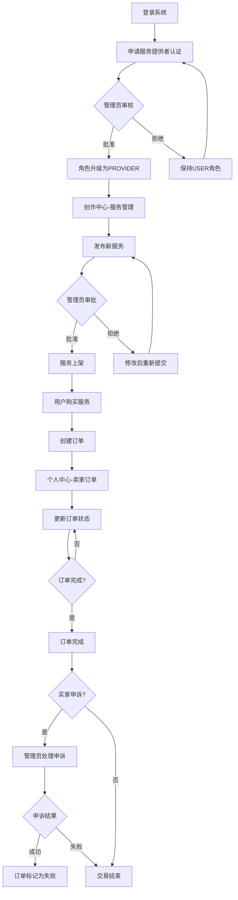
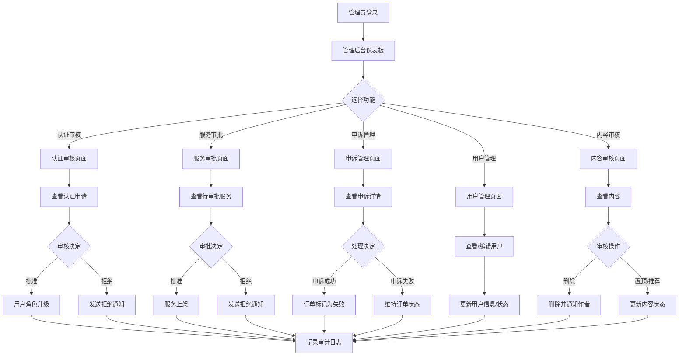
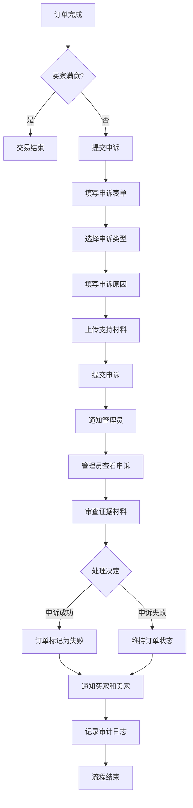

## 前端页面设计详解

本章节详细描述服务提供者端(PROVIDER)和管理员端(ADMIN)的所有页面布局、功能模块、交互流程和页面跳转逻辑。设计遵循CSDN风格的UI/UX模式,确保界面清晰、操作直观。

### 设计原则

1. **一致性**: 所有页面遵循统一的布局结构和交互模式
2. **扁平化导航**: 采用一级菜单+页面内标签页的设计,避免多级菜单
3. **响应式设计**: 支持桌面端和移动端自适应
4. **操作反馈**: 所有操作提供明确的视觉反馈和状态提示
5. **权限控制**: 根据用户角色动态显示功能和菜单

### 通用布局结构

所有页面采用统一的三栏布局:

```
┌─────────────────────────────────────────────────────────────┐
│                      顶部导航栏 (Header)                      │
│  Logo | 搜索框 | 通知 | 用户头像                              │
├──────────┬──────────────────────────────────────────────────┤
│          │                                                  │
│  侧边栏   │              主内容区                             │
│  (Sidebar)│           (Main Content)                        │
│          │                                                  │
│  菜单项   │  面包屑导航                                        │
│  ...     │  ┌────────────────────────────────────────┐     │
│          │  │                                        │     │
│          │  │         页面内容                        │     │
│          │  │                                        │     │
│          │  └────────────────────────────────────────┘     │
│          │                                                  │
└──────────┴──────────────────────────────────────────────────┘
```

#### 顶部导航栏组件

**组件位置**: `src/components/common/Header.vue`

**功能模块**:
1. **Logo区域**: 点击返回首页
2. **全局搜索**: 支持搜索文章、需求、服务
3. **通知中心**: 显示未读通知数量,点击展开通知列表
4. **用户菜单**: 头像+下拉菜单(个人中心、设置、退出登录)


## 服务提供者端(PROVIDER)页面设计

服务提供者拥有普通用户的所有功能,额外增加服务管理相关功能。

### 1. 创作中心页面 (Creator Center)

**路由路径**: `/creator`

**页面布局**:

```
┌─────────────────────────────────────────────────────────────┐
│  面包屑: 首页 > 创作中心                                        │
├─────────────────────────────────────────────────────────────┤
│  ┌─────────┬─────────┬─────────┐                            │
│  │ 文章管理 │ 需求管理 │ 服务管理 │  ← 标签页导航              │
│  └─────────┴─────────┴─────────┘                            │
├─────────────────────────────────────────────────────────────┤
│  [+ 发布新服务]  按钮                                          │
├─────────────────────────────────────────────────────────────┤
│  筛选器: [全部状态 ▼] [全部类别 ▼] [搜索框]                    │
├─────────────────────────────────────────────────────────────┤
│  ┌───────────────────────────────────────────────────────┐  │
│  │ 服务卡片 1                                             │  │
│  │ ┌────────┐                                            │  │
│  │ │ 封面图  │  服务标题                                   │  │
│  │ │        │  价格: ¥100  类别: Web开发                  │  │
│  │ └────────┘  状态: [待审批]                             │  │
│  │             [编辑] [删除] [查看详情]                    │  │
│  └───────────────────────────────────────────────────────┘  │
│  ┌───────────────────────────────────────────────────────┐  │
│  │ 服务卡片 2                                             │  │
│  │ ...                                                   │  │
│  └───────────────────────────────────────────────────────┘  │
│                                                             │
│  [分页组件: 1 2 3 ... 10]                                   │
└─────────────────────────────────────────────────────────────┘
```

**功能模块**:

1. **标签页切换**
   - 文章管理: 显示用户发布的所有文章
   - 需求管理: 显示用户发布的所有需求
   - 服务管理: 显示服务提供者发布的所有服务(仅PROVIDER和ADMIN可见)

2. **服务管理标签页详细功能**
   
   **操作按钮**:
   - `[+ 发布新服务]`: 打开服务创建表单
   
   **筛选器**:
   - 状态筛选: 全部 / 待审批 / 已上架 / 已拒绝 / 已下架
   - 类别筛选: 全部 / Web开发 / 移动开发 / 数据分析 / 设计 / 其他
   - 搜索框: 按服务标题搜索
   
   **服务卡片信息**:
   - 封面图(150x150px)
   - 服务标题
   - 价格
   - 类别
   - 状态标签(不同颜色):
     * 待审批: 橙色
     * 已上架: 绿色
     * 已拒绝: 红色
     * 已下架: 灰色
   - 操作按钮:
     * [编辑]: 打开编辑表单
     * [删除]: 弹出确认对话框
     * [查看详情]: 打开服务详情页

3. **服务创建/编辑表单**

**表单字段**:
```
┌─────────────────────────────────────────────────────────────┐
│  发布服务                                        [X 关闭]     │
├─────────────────────────────────────────────────────────────┤
│  服务标题 *                                                  │
│  ┌─────────────────────────────────────────────────────┐    │
│  │ 请输入服务标题(5-200字符)                            │    │
│  └─────────────────────────────────────────────────────┘    │
│                                                             │
│  服务类别 *                                                  │
│  ┌─────────────────────────────────────────────────────┐    │
│  │ [请选择类别 ▼]                                       │    │
│  └─────────────────────────────────────────────────────┘    │
│                                                             │
│  服务价格 *                                                  │
│  ┌─────────────────────────────────────────────────────┐    │
│  │ ¥ [输入价格]                                         │    │
│  └─────────────────────────────────────────────────────┘    │
│                                                             │
│  服务描述 *                                                  │
│  ┌─────────────────────────────────────────────────────┐    │
│  │                                                     │    │
│  │  富文本编辑器                                        │    │
│  │  (支持文本格式、图片、代码块)                         │    │
│  │                                                     │    │
│  └─────────────────────────────────────────────────────┘    │
│                                                             │
│  封面图片                                                    │
│  ┌─────────┐                                               │
│  │  [上传]  │  支持jpg/png,最大2MB                          │
│  └─────────┘                                               │
│                                                             │
│  服务周期                                                    │
│  ┌─────────────────────────────────────────────────────┐    │
│  │ [输入天数] 天                                         │    │
│  └─────────────────────────────────────────────────────┘    │
│                                                             │
│  ┌─────────┐  ┌─────────┐                                  │
│  │  取消    │  │  提交    │                                  │
│  └─────────┘  └─────────┘                                  │
└─────────────────────────────────────────────────────────────┘
```

**表单验证规则**:
- 服务标题: 必填,5-200字符
- 服务类别: 必填,从预定义列表选择
- 服务价格: 必填,大于0的数字,最多两位小数
- 服务描述: 必填,50-10000字符
- 封面图片: 可选,jpg/png格式,最大2MB
- 服务周期: 可选,正整数

**提交流程**:
1. 点击[提交]按钮
2. 前端验证所有字段
3. 调用API: `POST /api/v1/services`
4. 服务创建成功,状态为"待审批"
5. 显示成功提示: "服务已提交,等待管理员审核"
6. 关闭表单,刷新服务列表


### 2. 个人中心 - 卖家订单页面

**路由路径**: `/profile` (标签页: seller-orders)

**页面布局**:

```
┌─────────────────────────────────────────────────────────────┐
│  面包屑: 首页 > 个人中心                                        │
├─────────────────────────────────────────────────────────────┤
│  ┌──────┬──────┬──────┬──────┬──────┬──────┐                │
│  │个人信息│我的订单│卖家订单│订单申诉│消息通知│系统设置│ ← 标签页  │
│  └──────┴──────┴──────┴──────┴──────┴──────┘                │
├─────────────────────────────────────────────────────────────┤
│  筛选器: [全部状态 ▼] [日期范围] [搜索订单号/买家]             │
├─────────────────────────────────────────────────────────────┤
│  统计卡片:                                                    │
│  ┌──────────┬──────────┬──────────┬──────────┐              │
│  │ 待处理    │ 进行中    │ 已完成    │ 已失败    │              │
│  │   5      │   12     │   89     │   3      │              │
│  └──────────┴──────────┴──────────┴──────────┘              │
├─────────────────────────────────────────────────────────────┤
│  ┌───────────────────────────────────────────────────────┐  │
│  │ 订单卡片 #20240101001                                  │  │
│  │ ┌────────┐                                            │  │
│  │ │服务图标 │  服务名称: Vue.js项目开发                   │  │
│  │ └────────┘  买家: 张三                                 │  │
│  │             金额: ¥500.00                             │  │
│  │             下单时间: 2024-01-01 10:30                 │  │
│  │             状态: [进行中]                             │  │
│  │             [查看详情] [更新状态] [联系买家]            │  │
│  └───────────────────────────────────────────────────────┘  │
│  ┌───────────────────────────────────────────────────────┐  │
│  │ 订单卡片 #20240101002                                  │  │
│  │ ...                                                   │  │
│  └───────────────────────────────────────────────────────┘  │
│                                                             │
│  [分页组件]                                                  │
└─────────────────────────────────────────────────────────────┘
```

**功能模块**:

1. **筛选和搜索**
   - 状态筛选: 全部 / 待处理 / 进行中 / 已完成 / 已失败
   - 日期范围: 最近7天 / 最近30天 / 最近90天 / 自定义
   - 搜索: 支持按订单号、买家名称搜索

2. **统计卡片**
   - 实时显示各状态订单数量
   - 点击卡片自动筛选对应状态的订单

3. **订单卡片操作**
   - `[查看详情]`: 打开订单详情弹窗
   - `[更新状态]`: 打开状态更新对话框
   - `[联系买家]`: 打开站内消息对话框(可选功能)

4. **订单状态更新对话框**

```
┌─────────────────────────────────────────────────────────────┐
│  更新订单状态                                    [X 关闭]     │
├─────────────────────────────────────────────────────────────┤
│  订单号: #20240101001                                        │
│  当前状态: 待处理                                             │
│                                                             │
│  新状态 *                                                    │
│  ┌─────────────────────────────────────────────────────┐    │
│  │ ○ 进行中                                             │    │
│  │ ○ 已完成                                             │    │
│  │ ○ 已失败                                             │    │
│  └─────────────────────────────────────────────────────┘    │
│                                                             │
│  备注说明                                                    │
│  ┌─────────────────────────────────────────────────────┐    │
│  │ 请输入状态变更说明...                                 │    │
│  └─────────────────────────────────────────────────────┘    │
│                                                             │
│  ┌─────────┐  ┌─────────┐                                  │
│  │  取消    │  │  确认    │                                  │
│  └─────────┘  └─────────┘                                  │
└─────────────────────────────────────────────────────────────┘
```

**状态转换规则**:
- 待处理 → 进行中 / 已失败
- 进行中 → 已完成 / 已失败
- 已完成 / 已失败: 终态,不可更改

**操作流程**:
1. 选择新状态
2. 填写备注说明(可选)
3. 点击[确认]
4. 调用API: `PUT /api/v1/orders/{id}/status`
5. 更新成功后:
   - 显示成功提示
   - 刷新订单列表
   - 向买家发送通知


### 3. 服务详情页面 (Service Detail)

**路由路径**: `/services/{id}` (详情弹窗模式)

**页面布局**:

```
┌─────────────────────────────────────────────────────────────┐
│  服务详情                                        [X 关闭]     │
├─────────────────────────────────────────────────────────────┤
│  ┌─────────────────────────────────────────────────────┐    │
│  │                   封面图片                           │    │
│  │                 (800x400px)                         │    │
│  └─────────────────────────────────────────────────────┘    │
│                                                             │
│  服务标题                                                    │
│  ┌─────────────────────────────────────────────────────┐    │
│  │ Vue.js全栈项目开发服务                                │    │
│  └─────────────────────────────────────────────────────┘    │
│                                                             │
│  ┌──────────┬──────────┬──────────┬──────────┐              │
│  │ 价格      │ 类别      │ 评分      │ 状态      │              │
│  │ ¥500.00  │ Web开发   │ 4.8★     │ 已上架    │              │
│  └──────────┴──────────┴──────────┴──────────┘              │
│                                                             │
│  提供者信息                                                  │
│  ┌────┐                                                     │
│  │头像 │  用户名: 李四                                        │
│  └────┘  认证: ✓ 服务提供者                                  │
│          [查看主页] [订阅]                                    │
│                                                             │
│  服务描述                                                    │
│  ┌─────────────────────────────────────────────────────┐    │
│  │                                                     │    │
│  │  详细的服务描述内容...                                │    │
│  │  (支持富文本显示)                                     │    │
│  │                                                     │    │
│  └─────────────────────────────────────────────────────┘    │
│                                                             │
│  服务周期: 7天                                               │
│                                                             │
│  ┌─────────────────┐                                        │
│  │  [购买服务]      │  ← 仅普通用户可见                       │
│  └─────────────────┘                                        │
│                                                             │
│  ┌─────────────────┐  ┌─────────────────┐                  │
│  │  [编辑]          │  │  [删除]          │  ← 仅所有者可见   │
│  └─────────────────┘  └─────────────────┘                  │
└─────────────────────────────────────────────────────────────┘
```

**权限控制**:
- 所有用户: 可查看已上架的服务详情
- 服务所有者: 可编辑、删除自己的服务
- 管理员: 可编辑、删除任何服务

---

## 管理员端(ADMIN)页面设计

管理员使用独立的后台管理布局,与普通用户界面分离。

### 管理员侧边栏菜单

```
┌──────────────────┐
│  管理后台         │
├──────────────────┤
│  📊 仪表板        │
│  👥 用户管理      │
│  📝 内容审核      │
│  🛍️ 服务审批      │
│  ⚠️ 申诉管理      │
│  🎓 认证审核      │
│  📋 审计日志      │
│                  │
│  ← 返回前台      │
└──────────────────┘
```

### 1. 管理员仪表板页面 (Admin Dashboard)

**路由路径**: `/admin/dashboard`

**页面布局**:

```
┌─────────────────────────────────────────────────────────────┐
│  面包屑: 管理后台 > 仪表板                                      │
├─────────────────────────────────────────────────────────────┤
│  时间范围选择: [最近7天 ▼] [自定义日期范围]                     │
├─────────────────────────────────────────────────────────────┤
│  关键指标卡片                                                 │
│  ┌──────────┬──────────┬──────────┬──────────┐              │
│  │ 总用户数  │ 活跃用户  │ 总订单数  │ 总收入    │              │
│  │  1,234   │   856    │   456    │ ¥45,600  │              │
│  │  ↑ 12%   │  ↑ 8%    │  ↑ 15%   │  ↑ 20%   │              │
│  └──────────┴──────────┴──────────┴──────────┘              │
├─────────────────────────────────────────────────────────────┤
│  订单趋势图表                                                 │
│  ┌─────────────────────────────────────────────────────┐    │
│  │                                                     │    │
│  │   📈 折线图: 订单数量趋势                            │    │
│  │      (横轴:日期, 纵轴:订单数)                        │    │
│  │                                                     │    │
│  └─────────────────────────────────────────────────────┘    │
├─────────────────────────────────────────────────────────────┤
│  订单状态分布                                                 │
│  ┌──────────┬──────────┬──────────┬──────────┐              │
│  │ 待处理    │ 进行中    │ 已完成    │ 已失败    │              │
│  │   45     │   123    │   267    │   21     │              │
│  └──────────┴──────────┴──────────┴──────────┘              │
├─────────────────────────────────────────────────────────────┤
│  服务类别排名                                                 │
│  ┌─────────────────────────────────────────────────────┐    │
│  │  1. Web开发        ████████████████████  156订单     │    │
│  │  2. 移动开发       ████████████  89订单               │    │
│  │  3. 数据分析       ████████  67订单                   │    │
│  │  4. 设计          ██████  45订单                     │    │
│  │  5. 其他          ████  34订单                       │    │
│  └─────────────────────────────────────────────────────┘    │
├─────────────────────────────────────────────────────────────┤
│  待处理事项                                                   │
│  ┌─────────────────────────────────────────────────────┐    │
│  │  ⚠️ 待审批服务: 12个      [去处理]                    │    │
│  │  ⚠️ 待处理申诉: 5个       [去处理]                    │    │
│  │  ⚠️ 待审核认证: 8个       [去处理]                    │    │
│  └─────────────────────────────────────────────────────┘    │
└─────────────────────────────────────────────────────────────┘
```

**功能模块**:

1. **时间范围选择**
   - 预设选项: 最近7天 / 最近30天 / 最近90天
   - 自定义日期范围选择器
   - 选择后自动刷新所有图表和统计数据

2. **关键指标卡片**
   - 显示核心业务指标
   - 显示与上一周期的对比百分比
   - 点击卡片可跳转到详细页面

3. **订单趋势图表**
   - 使用ECharts或Chart.js绘制
   - 显示选定时间范围内的订单数量变化
   - 支持鼠标悬停显示具体数值

4. **服务类别排名**
   - 横向条形图显示各类别订单数量
   - 按订单数量降序排列
   - 显示前5个类别

5. **待处理事项**
   - 实时显示需要管理员处理的任务数量
   - 点击[去处理]按钮跳转到对应管理页面

**数据刷新**:
- 页面加载时获取数据
- 每5分钟自动刷新一次
- 手动刷新按钮


### 2. 用户管理页面 (User Management)

**路由路径**: `/admin/users`

**页面布局**:

```
┌─────────────────────────────────────────────────────────────┐
│  面包屑: 管理后台 > 用户管理                                    │
├─────────────────────────────────────────────────────────────┤
│  搜索和筛选                                                   │
│  ┌──────────────┬──────────────┬──────────────┐             │
│  │ [搜索用户名/邮箱] │ [角色筛选 ▼]  │ [状态筛选 ▼]  │             │
│  └──────────────┴──────────────┴──────────────┘             │
├─────────────────────────────────────────────────────────────┤
│  用户列表表格                                                 │
│  ┌─────────────────────────────────────────────────────┐    │
│  │ ID │ 头像 │ 用户名 │ 邮箱 │ 角色 │ 状态 │ 注册时间 │ 操作 │    │
│  ├─────────────────────────────────────────────────────┤    │
│  │ 1  │ 🧑  │ 张三  │ z@x.com │ USER │ 活跃 │ 2024-01-01 │ ... │    │
│  │ 2  │ 👨  │ 李四  │ l@x.com │ PROVIDER │ 活跃 │ 2024-01-02 │ ... │    │
│  │ 3  │ 👩  │ 王五  │ w@x.com │ USER │ 暂停 │ 2024-01-03 │ ... │    │
│  └─────────────────────────────────────────────────────┘    │
│                                                             │
│  [分页组件: 1 2 3 ... 10]  每页显示: [20 ▼]                  │
└─────────────────────────────────────────────────────────────┘
```

**功能模块**:

1. **搜索和筛选**
   - 搜索框: 支持按用户名、邮箱搜索
   - 角色筛选: 全部 / USER / PROVIDER / ADMIN
   - 状态筛选: 全部 / 活跃 / 暂停 / 已删除

2. **用户列表表格**
   
   **表格列**:
   - ID: 用户唯一标识
   - 头像: 用户头像缩略图
   - 用户名: 可点击查看详情
   - 邮箱: 用户邮箱地址
   - 角色: 显示角色标签(不同颜色)
   - 状态: 显示状态标签
   - 注册时间: YYYY-MM-DD格式
   - 操作: 操作按钮组
   
   **操作按钮**:
   - `[查看]`: 打开用户详情弹窗
   - `[编辑]`: 打开用户编辑弹窗
   - `[暂停/激活]`: 切换用户状态
   - `[更多 ▼]`: 下拉菜单
     * 更改角色
     * 重置密码
     * 删除用户

3. **用户详情弹窗**

```
┌─────────────────────────────────────────────────────────────┐
│  用户详情                                        [X 关闭]     │
├─────────────────────────────────────────────────────────────┤
│  基本信息                                                    │
│  ┌────┐                                                     │
│  │头像 │  用户名: 张三                                        │
│  └────┘  邮箱: zhangsan@example.com                         │
│          电话: 138****1234                                  │
│          角色: [USER]                                       │
│          状态: [活跃]                                        │
│          注册时间: 2024-01-01 10:30:00                       │
│          最后登录: 2024-01-15 14:20:00                       │
├─────────────────────────────────────────────────────────────┤
│  活动统计                                                    │
│  ┌──────────┬──────────┬──────────┬──────────┐              │
│  │ 发布文章  │ 发布需求  │ 购买订单  │ 收藏数    │              │
│  │   12     │   5      │   8      │   23     │              │
│  └──────────┴──────────┴──────────┴──────────┘              │
├─────────────────────────────────────────────────────────────┤
│  操作历史 (最近10条)                                          │
│  ┌─────────────────────────────────────────────────────┐    │
│  │ 2024-01-15 14:20  登录系统                           │    │
│  │ 2024-01-15 10:30  发布文章: "Vue3新特性"              │    │
│  │ 2024-01-14 16:45  购买服务: "网站开发"                │    │
│  │ ...                                                 │    │
│  └─────────────────────────────────────────────────────┘    │
├─────────────────────────────────────────────────────────────┤
│  ┌─────────┐  ┌─────────┐  ┌─────────┐                      │
│  │  编辑    │  │ 暂停账户 │  │  关闭    │                      │
│  └─────────┘  └─────────┘  └─────────┘                      │
└─────────────────────────────────────────────────────────────┘
```

4. **用户编辑弹窗**

```
┌─────────────────────────────────────────────────────────────┐
│  编辑用户                                        [X 关闭]     │
├─────────────────────────────────────────────────────────────┤
│  用户名                                                      │
│  ┌─────────────────────────────────────────────────────┐    │
│  │ 张三                                                 │    │
│  └─────────────────────────────────────────────────────┘    │
│                                                             │
│  邮箱                                                        │
│  ┌─────────────────────────────────────────────────────┐    │
│  │ zhangsan@example.com                                │    │
│  └─────────────────────────────────────────────────────┘    │
│                                                             │
│  电话                                                        │
│  ┌─────────────────────────────────────────────────────┐    │
│  │ 13812341234                                         │    │
│  └─────────────────────────────────────────────────────┘    │
│                                                             │
│  角色 *                                                      │
│  ┌─────────────────────────────────────────────────────┐    │
│  │ ○ USER  ○ PROVIDER  ○ ADMIN                         │    │
│  └─────────────────────────────────────────────────────┘    │
│                                                             │
│  状态 *                                                      │
│  ┌─────────────────────────────────────────────────────┐    │
│  │ ○ 活跃  ○ 暂停  ○ 已删除                             │    │
│  └─────────────────────────────────────────────────────┘    │
│                                                             │
│  备注说明                                                    │
│  ┌─────────────────────────────────────────────────────┐    │
│  │ 请输入操作备注...                                     │    │
│  └─────────────────────────────────────────────────────┘    │
│                                                             │
│  ┌─────────┐  ┌─────────┐                                  │
│  │  取消    │  │  保存    │                                  │
│  └─────────┘  └─────────┘                                  │
└─────────────────────────────────────────────────────────────┘
```

**操作流程**:
1. 修改用户信息
2. 填写备注说明(必填)
3. 点击[保存]
4. 调用API: `PUT /api/v1/users/{id}`
5. 记录审计日志
6. 显示成功提示
7. 刷新用户列表

**权限说明**:
- 管理员可以修改任何用户的信息
- 修改角色时需要特别谨慎
- 所有操作都会记录到审计日志


### 3. 服务审批页面 (Service Approval)

**路由路径**: `/admin/services`

**页面布局**:

```
┌─────────────────────────────────────────────────────────────┐
│  面包屑: 管理后台 > 服务审批                                    │
├─────────────────────────────────────────────────────────────┤
│  筛选器                                                      │
│  ┌──────────────┬──────────────┬──────────────┐             │
│  │ [状态筛选 ▼]  │ [类别筛选 ▼]  │ [搜索服务名称] │             │
│  └──────────────┴──────────────┴──────────────┘             │
├─────────────────────────────────────────────────────────────┤
│  待审批服务列表                                               │
│  ┌───────────────────────────────────────────────────────┐  │
│  │ 服务卡片 1                                             │  │
│  │ ┌────────┐                                            │  │
│  │ │ 封面图  │  服务名称: Vue.js全栈开发                   │  │
│  │ │        │  提供者: 李四                               │  │
│  │ └────────┘  价格: ¥500.00  类别: Web开发               │  │
│  │             提交时间: 2024-01-15 10:30                 │  │
│  │             状态: [待审批]                             │  │
│  │             [查看详情] [批准] [拒绝]                    │  │
│  └───────────────────────────────────────────────────────┘  │
│  ┌───────────────────────────────────────────────────────┐  │
│  │ 服务卡片 2                                             │  │
│  │ ...                                                   │  │
│  └───────────────────────────────────────────────────────┘  │
│                                                             │
│  [分页组件]                                                  │
└─────────────────────────────────────────────────────────────┘
```

**功能模块**:

1. **筛选器**
   - 状态筛选: 全部 / 待审批 / 已批准 / 已拒绝
   - 类别筛选: 全部 / Web开发 / 移动开发 / 数据分析 / 设计 / 其他
   - 搜索: 按服务名称搜索

2. **服务详情查看弹窗**

```
┌─────────────────────────────────────────────────────────────┐
│  服务审批详情                                    [X 关闭]     │
├─────────────────────────────────────────────────────────────┤
│  ┌─────────────────────────────────────────────────────┐    │
│  │                   封面图片                           │    │
│  └─────────────────────────────────────────────────────┘    │
│                                                             │
│  服务信息                                                    │
│  服务名称: Vue.js全栈项目开发服务                             │
│  服务类别: Web开发                                           │
│  服务价格: ¥500.00                                          │
│  服务周期: 7天                                               │
│  提交时间: 2024-01-15 10:30:00                              │
│  当前状态: 待审批                                            │
│                                                             │
│  提供者信息                                                  │
│  ┌────┐                                                     │
│  │头像 │  用户名: 李四                                        │
│  └────┘  认证状态: ✓ 已认证                                  │
│          历史服务: 12个                                      │
│          平均评分: 4.8★                                      │
│          [查看提供者详情]                                     │
│                                                             │
│  服务描述                                                    │
│  ┌─────────────────────────────────────────────────────┐    │
│  │                                                     │    │
│  │  详细的服务描述内容...                                │    │
│  │  (富文本显示)                                        │    │
│  │                                                     │    │
│  └─────────────────────────────────────────────────────┘    │
│                                                             │
│  审核操作                                                    │
│  ┌─────────────────────────────────────────────────────┐    │
│  │ ○ 批准服务                                           │    │
│  │ ○ 拒绝服务                                           │    │
│  └─────────────────────────────────────────────────────┘    │
│                                                             │
│  审核意见 (拒绝时必填)                                        │
│  ┌─────────────────────────────────────────────────────┐    │
│  │ 请输入审核意见...                                     │    │
│  └─────────────────────────────────────────────────────┘    │
│                                                             │
│  ┌─────────┐  ┌─────────┐                                  │
│  │  取消    │  │  提交    │                                  │
│  └─────────┘  └─────────┘                                  │
└─────────────────────────────────────────────────────────────┘
```

**审批流程**:

1. **批准服务**:
   - 选择"批准服务"
   - 审核意见可选
   - 点击[提交]
   - 调用API: `PUT /api/v1/services/{id}/approve`
   - 服务状态变更为"已上架"
   - 向服务提供者发送通知: "您的服务已通过审核"
   - 记录审计日志
   - 刷新列表

2. **拒绝服务**:
   - 选择"拒绝服务"
   - 审核意见必填(说明拒绝原因)
   - 点击[提交]
   - 调用API: `PUT /api/v1/services/{id}/reject`
   - 服务状态变更为"已拒绝"
   - 向服务提供者发送通知,包含拒绝原因
   - 记录审计日志
   - 刷新列表

**审核标准**:
- 服务描述是否清晰完整
- 价格是否合理
- 是否符合平台规范
- 是否存在违规内容


### 4. 申诉管理页面 (Appeal Management)

**路由路径**: `/admin/appeals`

**页面布局**:

```
┌─────────────────────────────────────────────────────────────┐
│  面包屑: 管理后台 > 申诉管理                                    │
├─────────────────────────────────────────────────────────────┤
│  筛选器                                                      │
│  ┌──────────────┬──────────────┬──────────────┐             │
│  │ [状态筛选 ▼]  │ [类型筛选 ▼]  │ [搜索订单号]  │             │
│  └──────────────┴──────────────┴──────────────┘             │
├─────────────────────────────────────────────────────────────┤
│  申诉列表                                                    │
│  ┌───────────────────────────────────────────────────────┐  │
│  │ 申诉卡片 1                                             │  │
│  │ 订单号: #20240101001                                   │  │
│  │ 申诉人: 张三                                            │  │
│  │ 服务提供者: 李四                                        │  │
│  │ 申诉类型: [服务不达标]                                  │  │
│  │ 提交时间: 2024-01-15 10:30                             │  │
│  │ 状态: [待处理]                                         │  │
│  │ [查看详情] [处理]                                       │  │
│  └───────────────────────────────────────────────────────┘  │
│  ┌───────────────────────────────────────────────────────┐  │
│  │ 申诉卡片 2                                             │  │
│  │ ...                                                   │  │
│  └───────────────────────────────────────────────────────┘  │
│                                                             │
│  [分页组件]                                                  │
└─────────────────────────────────────────────────────────────┘
```

**功能模块**:

1. **筛选器**
   - 状态筛选: 全部 / 待处理 / 申诉成功 / 申诉失败
   - 类型筛选: 全部 / 服务不达标 / 未按时交付
   - 搜索: 按订单号搜索

2. **申诉详情处理弹窗**

```
┌─────────────────────────────────────────────────────────────┐
│  申诉处理                                        [X 关闭]     │
├─────────────────────────────────────────────────────────────┤
│  订单信息                                                    │
│  订单号: #20240101001                                        │
│  服务名称: Vue.js项目开发                                     │
│  订单金额: ¥500.00                                          │
│  下单时间: 2024-01-01 10:30                                  │
│  订单状态: 已完成                                            │
├─────────────────────────────────────────────────────────────┤
│  交易双方                                                    │
│  买家(申诉人): 张三                                          │
│  卖家(服务提供者): 李四                                       │
├─────────────────────────────────────────────────────────────┤
│  申诉信息                                                    │
│  申诉类型: 服务不达标                                        │
│  提交时间: 2024-01-15 10:30                                  │
│                                                             │
│  申诉原因:                                                   │
│  ┌─────────────────────────────────────────────────────┐    │
│  │ 服务质量不符合约定,代码存在多处bug,                    │    │
│  │ 且未按时交付完整功能...                                │    │
│  └─────────────────────────────────────────────────────┘    │
│                                                             │
│  支持材料:                                                   │
│  ┌─────────────────────────────────────────────────────┐    │
│  │ 📎 screenshot1.png                                  │    │
│  │ 📎 chat_record.pdf                                  │    │
│  │ 📎 bug_list.docx                                    │    │
│  └─────────────────────────────────────────────────────┘    │
├─────────────────────────────────────────────────────────────┤
│  历史沟通记录 (如有)                                          │
│  ┌─────────────────────────────────────────────────────┐    │
│  │ 2024-01-10  买家: 请问什么时候能完成?                 │    │
│  │ 2024-01-11  卖家: 预计本周五完成                      │    │
│  │ ...                                                 │    │
│  └─────────────────────────────────────────────────────┘    │
├─────────────────────────────────────────────────────────────┤
│  处理决定 *                                                  │
│  ┌─────────────────────────────────────────────────────┐    │
│  │ ○ 申诉成功 (订单将标记为失败,可能触发退款)            │    │
│  │ ○ 申诉失败 (维持订单原状态)                           │    │
│  └─────────────────────────────────────────────────────┘    │
│                                                             │
│  处理意见 *                                                  │
│  ┌─────────────────────────────────────────────────────┐    │
│  │ 请输入处理意见和理由...                               │    │
│  └─────────────────────────────────────────────────────┘    │
│                                                             │
│  ┌─────────┐  ┌─────────┐                                  │
│  │  取消    │  │  提交    │                                  │
│  └─────────┘  └─────────┘                                  │
└─────────────────────────────────────────────────────────────┘
```

**处理流程**:

1. **申诉成功**:
   - 选择"申诉成功"
   - 填写处理意见(必填)
   - 点击[提交]
   - 调用API: `PUT /api/v1/appeals/{id}/resolve`
   - 申诉状态变更为"申诉成功"
   - 订单状态变更为"已失败"
   - 向买家发送通知: "您的申诉已通过"
   - 向卖家发送通知: "订单申诉成立"
   - 记录审计日志(包含处理人、处理时间、处理意见)
   - 刷新列表

2. **申诉失败**:
   - 选择"申诉失败"
   - 填写处理意见(必填,说明拒绝理由)
   - 点击[提交]
   - 调用API: `PUT /api/v1/appeals/{id}/resolve`
   - 申诉状态变更为"申诉失败"
   - 订单状态保持不变
   - 向买家发送通知,包含拒绝理由
   - 向卖家发送通知: "订单申诉已驳回"
   - 记录审计日志
   - 刷新列表

**处理原则**:
- 仔细审查申诉原因和支持材料
- 公平公正,基于事实判断
- 处理意见要清晰明确
- 必要时可联系双方了解详情


### 5. 认证审核页面 (Certification Review)

**路由路径**: `/admin/certifications`

**页面布局**:

```
┌─────────────────────────────────────────────────────────────┐
│  面包屑: 管理后台 > 认证审核                                    │
├─────────────────────────────────────────────────────────────┤
│  筛选器                                                      │
│  ┌──────────────┬──────────────┐                            │
│  │ [状态筛选 ▼]  │ [搜索申请人]  │                            │
│  └──────────────┴──────────────┘                            │
├─────────────────────────────────────────────────────────────┤
│  认证申请列表                                                 │
│  ┌───────────────────────────────────────────────────────┐  │
│  │ 申请卡片 1                                             │  │
│  │ ┌────┐                                                │  │
│  │ │头像 │  申请人: 王五                                   │  │
│  │ └────┘  邮箱: wangwu@example.com                       │  │
│  │         提交时间: 2024-01-15 10:30                     │  │
│  │         状态: [待审核]                                  │  │
│  │         [查看详情] [批准] [拒绝]                        │  │
│  └───────────────────────────────────────────────────────┘  │
│  ┌───────────────────────────────────────────────────────┐  │
│  │ 申请卡片 2                                             │  │
│  │ ...                                                   │  │
│  └───────────────────────────────────────────────────────┘  │
│                                                             │
│  [分页组件]                                                  │
└─────────────────────────────────────────────────────────────┘
```

**功能模块**:

1. **筛选器**
   - 状态筛选: 全部 / 待审核 / 已批准 / 已拒绝
   - 搜索: 按申请人用户名或邮箱搜索

2. **认证详情审核弹窗**

```
┌─────────────────────────────────────────────────────────────┐
│  服务提供者认证审核                              [X 关闭]     │
├─────────────────────────────────────────────────────────────┤
│  申请人信息                                                  │
│  ┌────┐                                                     │
│  │头像 │  用户名: 王五                                        │
│  └────┘  邮箱: wangwu@example.com                           │
│          电话: 139****5678                                  │
│          注册时间: 2024-01-01                                │
│          当前角色: USER                                      │
├─────────────────────────────────────────────────────────────┤
│  申请信息                                                    │
│  提交时间: 2024-01-15 10:30:00                              │
│  申请状态: 待审核                                            │
│                                                             │
│  认证资质材料:                                               │
│  ┌─────────────────────────────────────────────────────┐    │
│  │ 我是一名全栈开发工程师,拥有5年开发经验,              │    │
│  │ 擅长Vue.js、React、Node.js等技术栈。                │    │
│  │ 曾参与多个大型项目开发...                            │    │
│  │                                                     │    │
│  │ 附件:                                                │    │
│  │ 📎 身份证.jpg                                        │    │
│  │ 📎 技能证书.pdf                                      │    │
│  │ 📎 项目案例.zip                                      │    │
│  └─────────────────────────────────────────────────────┘    │
├─────────────────────────────────────────────────────────────┤
│  历史活动                                                    │
│  发布文章: 8篇                                               │
│  发布需求: 3个                                               │
│  购买服务: 5次                                               │
│  平台信誉: 良好                                              │
├─────────────────────────────────────────────────────────────┤
│  审核决定 *                                                  │
│  ┌─────────────────────────────────────────────────────┐    │
│  │ ○ 批准认证 (用户角色将升级为PROVIDER)                │    │
│  │ ○ 拒绝认证                                           │    │
│  └─────────────────────────────────────────────────────┘    │
│                                                             │
│  审核意见 (拒绝时必填)                                        │
│  ┌─────────────────────────────────────────────────────┐    │
│  │ 请输入审核意见...                                     │    │
│  └─────────────────────────────────────────────────────┘    │
│                                                             │
│  ┌─────────┐  ┌─────────┐                                  │
│  │  取消    │  │  提交    │                                  │
│  └─────────┘  └─────────┘                                  │
└─────────────────────────────────────────────────────────────┘
```

**审核流程**:

1. **批准认证**:
   - 选择"批准认证"
   - 审核意见可选
   - 点击[提交]
   - 调用API: `PUT /api/v1/admin/applications/{id}/approve`
   - 认证申请状态变更为"已批准"
   - 用户角色从USER升级为PROVIDER
   - 向申请人发送通知: "恭喜!您的服务提供者认证已通过"
   - 记录审计日志
   - 刷新列表

2. **拒绝认证**:
   - 选择"拒绝认证"
   - 审核意见必填(说明拒绝原因)
   - 点击[提交]
   - 调用API: `PUT /api/v1/admin/applications/{id}/reject`
   - 认证申请状态变更为"已拒绝"
   - 用户角色保持为USER
   - 向申请人发送通知,包含拒绝原因
   - 记录审计日志
   - 刷新列表

**审核标准**:
- 身份信息真实性
- 技能资质证明
- 平台活动记录
- 信誉评估


### 6. 内容审核页面 (Content Moderation)

**路由路径**: `/admin/content`

**页面布局**:

```
┌─────────────────────────────────────────────────────────────┐
│  面包屑: 管理后台 > 内容审核                                    │
├─────────────────────────────────────────────────────────────┤
│  ┌─────────┬─────────┬─────────┐                            │
│  │ 文章审核 │ 需求审核 │ 评论审核 │  ← 标签页导航              │
│  └─────────┴─────────┴─────────┘                            │
├─────────────────────────────────────────────────────────────┤
│  筛选器                                                      │
│  ┌──────────────┬──────────────┬──────────────┐             │
│  │ [类别筛选 ▼]  │ [排序方式 ▼]  │ [搜索标题]    │             │
│  └──────────────┴──────────────┴──────────────┘             │
├─────────────────────────────────────────────────────────────┤
│  内容列表                                                    │
│  ┌───────────────────────────────────────────────────────┐  │
│  │ 文章卡片 1                                             │  │
│  │ 标题: Vue3响应式原理深度解析                            │  │
│  │ 作者: 张三                                              │  │
│  │ 发布时间: 2024-01-15 10:30                             │  │
│  │ 浏览: 1,234  点赞: 89  收藏: 45                        │  │
│  │ [查看详情] [编辑] [删除] [置顶] [推荐]                  │  │
│  └───────────────────────────────────────────────────────┘  │
│  ┌───────────────────────────────────────────────────────┐  │
│  │ 文章卡片 2                                             │  │
│  │ ...                                                   │  │
│  └───────────────────────────────────────────────────────┘  │
│                                                             │
│  [分页组件]                                                  │
└─────────────────────────────────────────────────────────────┘
```

**功能模块**:

1. **标签页切换**
   - 文章审核: 管理所有文章
   - 需求审核: 管理所有需求
   - 评论审核: 管理所有评论(可选功能)

2. **筛选和排序**
   - 类别筛选: 全部 / 前端 / 后端 / 数据库 / 运维 / 算法 / 其他
   - 排序方式: 最新发布 / 最多浏览 / 最多点赞 / 最多举报
   - 搜索: 按标题或内容搜索

3. **内容操作**
   - `[查看详情]`: 打开内容详情页
   - `[编辑]`: 打开编辑器修改内容
   - `[删除]`: 删除内容(需确认)
   - `[置顶]`: 将内容置顶显示
   - `[推荐]`: 将内容标记为推荐

4. **删除确认对话框**

```
┌─────────────────────────────────────────────────────────────┐
│  确认删除                                        [X 关闭]     │
├─────────────────────────────────────────────────────────────┤
│  ⚠️ 您确定要删除这篇文章吗?                                   │
│                                                             │
│  文章标题: Vue3响应式原理深度解析                             │
│  作者: 张三                                                  │
│                                                             │
│  删除原因 *                                                  │
│  ┌─────────────────────────────────────────────────────┐    │
│  │ ○ 违反平台规定                                       │    │
│  │ ○ 内容质量低劣                                       │    │
│  │ ○ 涉及违法信息                                       │    │
│  │ ○ 其他原因                                           │    │
│  └─────────────────────────────────────────────────────┘    │
│                                                             │
│  详细说明 *                                                  │
│  ┌─────────────────────────────────────────────────────┐    │
│  │ 请输入删除原因的详细说明...                           │    │
│  └─────────────────────────────────────────────────────┘    │
│                                                             │
│  ☑ 向作者发送通知                                            │
│                                                             │
│  ┌─────────┐  ┌─────────┐                                  │
│  │  取消    │  │  确认删除 │                                  │
│  └─────────┘  └─────────┘                                  │
└─────────────────────────────────────────────────────────────┘
```

**删除流程**:
1. 选择删除原因
2. 填写详细说明(必填)
3. 勾选是否通知作者
4. 点击[确认删除]
5. 调用API: `DELETE /api/v1/articles/{id}`
6. 如勾选通知,向作者发送删除通知(包含删除原因)
7. 记录审计日志
8. 刷新列表


### 7. 审计日志页面 (Audit Logs)

**路由路径**: `/admin/audit-logs`

**页面布局**:

```
┌─────────────────────────────────────────────────────────────┐
│  面包屑: 管理后台 > 审计日志                                    │
├─────────────────────────────────────────────────────────────┤
│  筛选器                                                      │
│  ┌──────────┬──────────┬──────────┬──────────┐              │
│  │[操作类型▼]│[操作人▼]  │[日期范围] │[搜索]     │              │
│  └──────────┴──────────┴──────────┴──────────┘              │
├─────────────────────────────────────────────────────────────┤
│  日志列表表格                                                 │
│  ┌─────────────────────────────────────────────────────┐    │
│  │ 时间 │ 操作人 │ 操作类型 │ 目标 │ IP地址 │ 详情 │ 操作 │    │
│  ├─────────────────────────────────────────────────────┤    │
│  │ 2024-01-15 │ admin │ 用户管理 │ 用户#123 │ 192.168.1.1 │ ... │ [查看] │    │
│  │ 10:30:25   │       │ 角色变更 │          │             │     │        │    │
│  ├─────────────────────────────────────────────────────┤    │
│  │ 2024-01-15 │ admin │ 服务审批 │ 服务#456 │ 192.168.1.1 │ ... │ [查看] │    │
│  │ 10:25:10   │       │ 批准服务 │          │             │     │        │    │
│  ├─────────────────────────────────────────────────────┤    │
│  │ 2024-01-15 │ admin │ 申诉处理 │ 申诉#789 │ 192.168.1.1 │ ... │ [查看] │    │
│  │ 10:20:45   │       │ 申诉成功 │          │             │     │        │    │
│  └─────────────────────────────────────────────────────┘    │
│                                                             │
│  [分页组件]  [导出日志]                                       │
└─────────────────────────────────────────────────────────────┘
```

**功能模块**:

1. **筛选器**
   - 操作类型: 全部 / 用户管理 / 服务审批 / 申诉处理 / 认证审核 / 内容审核
   - 操作人: 全部管理员列表
   - 日期范围: 今天 / 最近7天 / 最近30天 / 自定义
   - 搜索: 按目标ID或关键词搜索

2. **日志详情弹窗**

```
┌─────────────────────────────────────────────────────────────┐
│  审计日志详情                                    [X 关闭]     │
├─────────────────────────────────────────────────────────────┤
│  基本信息                                                    │
│  日志ID: 12345                                              │
│  操作时间: 2024-01-15 10:30:25                              │
│  操作人: admin (管理员)                                      │
│  IP地址: 192.168.1.1                                        │
│  操作类型: 用户管理 - 角色变更                               │
├─────────────────────────────────────────────────────────────┤
│  操作目标                                                    │
│  目标类型: 用户                                              │
│  目标ID: 123                                                │
│  目标名称: 张三                                              │
├─────────────────────────────────────────────────────────────┤
│  操作详情                                                    │
│  ┌─────────────────────────────────────────────────────┐    │
│  │ {                                                   │    │
│  │   "action": "role_change",                          │    │
│  │   "before": {                                       │    │
│  │     "role": "USER"                                  │    │
│  │   },                                                │    │
│  │   "after": {                                        │    │
│  │     "role": "PROVIDER"                              │    │
│  │   },                                                │    │
│  │   "reason": "通过服务提供者认证审核"                 │    │
│  │ }                                                   │    │
│  └─────────────────────────────────────────────────────┘    │
├─────────────────────────────────────────────────────────────┤
│  ┌─────────┐                                                │
│  │  关闭    │                                                │
│  └─────────┘                                                │
└─────────────────────────────────────────────────────────────┘
```

3. **日志导出功能**
   - 支持导出为CSV或Excel格式
   - 可选择导出当前筛选结果或全部日志
   - 导出内容包含所有字段

**日志记录内容**:
- 用户认证事件(登录、登出)
- 管理员操作(用户管理、服务审批、申诉处理等)
- 订单交易记录
- 申诉提交和解决
- 所有记录包含时间戳、操作人、IP地址、操作详情

**日志保留策略**:
- 至少保留90天
- 重要日志永久保留
- 定期归档历史日志

---

## 页面流转图

### 服务提供者业务流程



### 管理员审核流程



### 订单申诉流程



---

## 响应式设计适配

### 移动端适配方案

所有页面需要适配移动端,主要调整:

1. **布局调整**
   - 侧边栏折叠为汉堡菜单
   - 表格转换为卡片列表
   - 多列布局改为单列
   - 操作按钮改为下拉菜单

2. **交互优化**
   - 增大点击区域(最小44x44px)
   - 使用底部操作栏
   - 支持手势操作(滑动、长按)
   - 优化表单输入体验

3. **性能优化**
   - 图片懒加载
   - 虚拟滚动
   - 减少初始加载内容
   - 使用骨架屏

### 断点设置

```scss
// 响应式断点
$breakpoints: (
  'mobile': 320px,
  'tablet': 768px,
  'desktop': 1024px,
  'wide': 1440px
);

// 使用示例
@media (max-width: 768px) {
  .sidebar {
    transform: translateX(-100%);
    
    &.open {
      transform: translateX(0);
    }
  }
  
  .main-content {
    margin-left: 0;
  }
}
```

---

## 组件复用设计

### 通用组件列表

1. **数据展示组件**
   - `DataTable`: 通用数据表格
   - `CardList`: 卡片列表
   - `StatusBadge`: 状态标签
   - `UserAvatar`: 用户头像
   - `EmptyState`: 空状态提示

2. **表单组件**
   - `FormDialog`: 表单对话框
   - `SearchBar`: 搜索栏
   - `FilterPanel`: 筛选面板
   - `DateRangePicker`: 日期范围选择器
   - `FileUpload`: 文件上传

3. **操作组件**
   - `ActionButtons`: 操作按钮组
   - `ConfirmDialog`: 确认对话框
   - `DropdownMenu`: 下拉菜单
   - `Pagination`: 分页组件

4. **反馈组件**
   - `Toast`: 消息提示
   - `Loading`: 加载状态
   - `ProgressBar`: 进度条
   - `Skeleton`: 骨架屏

### 组件使用示例

```vue
<template>
  <div class="page-container">
    <!-- 搜索和筛选 -->
    <FilterPanel
      :filters="filters"
      @change="handleFilterChange"
    />
    
    <!-- 数据表格 -->
    <DataTable
      :columns="columns"
      :data="tableData"
      :loading="loading"
      @row-click="handleRowClick"
    >
      <template #actions="{ row }">
        <ActionButtons
          :buttons="getActionButtons(row)"
          @action="handleAction"
        />
      </template>
    </DataTable>
    
    <!-- 分页 -->
    <Pagination
      :current="currentPage"
      :total="totalPages"
      @change="handlePageChange"
    />
    
    <!-- 详情对话框 -->
    <FormDialog
      v-model="dialogVisible"
      :title="dialogTitle"
      @submit="handleSubmit"
    >
      <template #default>
        <!-- 表单内容 -->
      </template>
    </FormDialog>
  </div>
</template>
```

---

## 性能优化建议

### 前端性能优化

1. **代码分割**
   - 路由懒加载
   - 组件按需加载
   - 第三方库按需引入

2. **资源优化**
   - 图片压缩和WebP格式
   - 使用CDN加速
   - 启用Gzip压缩
   - 合理使用缓存

3. **渲染优化**
   - 虚拟滚动长列表
   - 防抖和节流
   - 使用v-show代替v-if(频繁切换)
   - 合理使用keep-alive

4. **数据优化**
   - 分页加载
   - 接口数据缓存
   - 减少不必要的请求
   - 使用WebSocket推送实时数据

### 用户体验优化

1. **加载体验**
   - 骨架屏
   - 加载进度提示
   - 乐观更新
   - 预加载关键资源

2. **交互反馈**
   - 操作成功/失败提示
   - 表单验证实时反馈
   - 按钮加载状态
   - 禁用重复提交

3. **错误处理**
   - 友好的错误提示
   - 网络错误重试
   - 降级方案
   - 错误边界

---

## 开发规范

### 命名规范

1. **文件命名**
   - 组件: PascalCase (UserCard.vue)
   - 工具函数: camelCase (formatDate.js)
   - 样式文件: kebab-case (user-card.scss)

2. **变量命名**
   - 常量: UPPER_SNAKE_CASE
   - 变量/函数: camelCase
   - 组件: PascalCase
   - CSS类: kebab-case

3. **API命名**
   - RESTful风格
   - 使用复数名词
   - 动词使用HTTP方法

### 代码规范

1. **Vue组件结构**
```vue
<template>
  <!-- 模板内容 -->
</template>

<script setup>
// 1. 导入
import { ref, computed, onMounted } from 'vue'

// 2. Props定义
const props = defineProps({
  // ...
})

// 3. Emits定义
const emit = defineEmits(['update', 'delete'])

// 4. 响应式数据
const data = ref([])

// 5. 计算属性
const filteredData = computed(() => {
  // ...
})

// 6. 方法
const handleClick = () => {
  // ...
}

// 7. 生命周期
onMounted(() => {
  // ...
})
</script>

<style scoped lang="scss">
// 样式
</style>
```

2. **注释规范**
   - 组件顶部添加功能说明
   - 复杂逻辑添加注释
   - 公共函数添加JSDoc注释

3. **提交规范**
   - feat: 新功能
   - fix: 修复bug
   - docs: 文档更新
   - style: 代码格式调整
   - refactor: 重构
   - test: 测试相关
   - chore: 构建/工具相关

